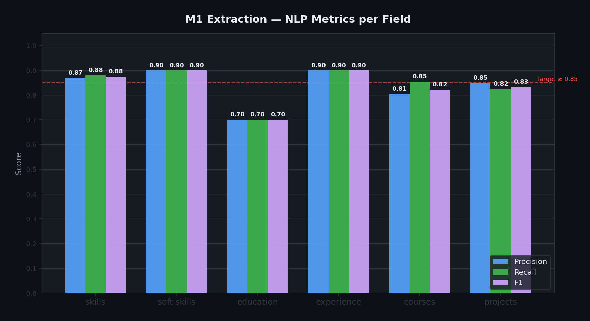
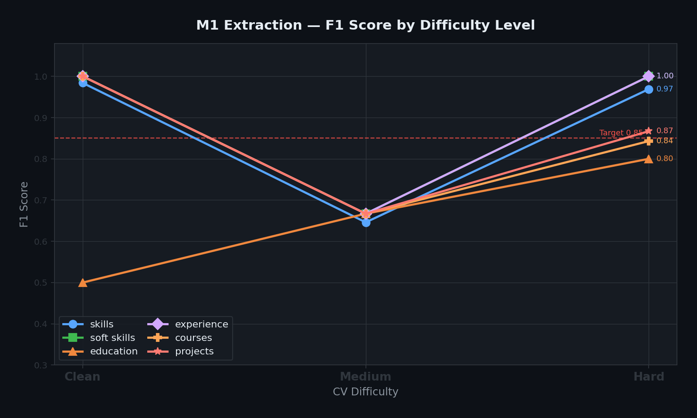

# M1 — CV Extraction Service

FastAPI microservice that parses CV documents (PDF, DOCX, plain text) and extracts structured information using a LangChain + Groq LLM pipeline.

---

## Architecture

```
POST /run
   │
   ├── core/file_parser.py   ← PDF/DOCX/TXT → raw text (PyMuPDF / python-docx)
   ├── core/chunker.py       ← Trim to model context window (4 000 chars)
   ├── core/lc_extractor.py  ← LangChain chain: Prompt → Groq LLM → PydanticParser
   │                            (with retry-with-backoff for HTTP 429)
   └── schemas.py            ← Pydantic output schema (ResumeData)
```

**LLM**: `llama-3.1-8b-instant` via Groq API (falls back to local Ollama `llama3` when `GROQ_API_KEY` is not set)

---

## API Reference

### `POST /run`

Accepts a CV as a file upload or raw text and returns structured extraction.

| Form Field | Type | Required | Description |
|---|---|---|---|
| `resumeFile` | File | one of | PDF, DOCX, or TXT upload |
| `resumeText` | string | one of | Plain text resume (alternative to file) |
| `userId` | string | No | Optional user identifier for logging |

**Success response `200`**
```json
{
  "success": true,
  "version": "1.0",
  "userId": "string | null",
  "extractedData": {
    "name": "string | null",
    "email": "string | null",
    "phone": "string | null",
    "location": "string | null",
    "education": [
      { "degree": "BSc", "field": "Computer Science", "institution": "Cairo University", "start": "2018", "end": "2022" }
    ],
    "experience": [
      { "title": "Software Engineer", "company": "Acme Corp", "location": "Cairo", "duration": "Jan 2022 - Present", "description": "..." }
    ],
    "courses": ["Machine Learning Specialisation"],
    "projects": ["E-commerce Platform", "Chatbot"],
    "skills": ["python", "fastapi", "sql"],
    "soft_skills": ["communication", "leadership"]
  },
  "meta": {
    "charsProcessed": 3800,
    "processingTimeMs": 1240
  }
}
```

**Error responses**

| Code | Reason |
|---|---|
| `400` | Neither `resumeFile` nor `resumeText` provided |
| `415` | Unsupported file type (only PDF, DOCX, TXT accepted) |
| `422` | Parsed file contained no extractable text (image-only PDF) |
| `500` | Unexpected server error |

### `GET /health`

Returns `{"status": "ok"}` — use for liveness probes.

---

## Setup

```bash
# 1. Install dependencies
pip install -r requirements.txt

# 2. Configure environment
cp .env.example .env
# Edit .env and add: GROQ_API_KEY=gsk_...

# 3. Start the server
uvicorn main:app --port 8001
```

### Environment Variables

| Variable | Required | Description |
|---|---|---|
| `GROQ_API_KEY` | Yes (or use Ollama) | Groq API key for LLM inference |
| `ALLOWED_ORIGIN` | No | Additional CORS origin to allow |

---

## Running Tests

```bash
pytest          # 5 unit tests covering file parsing, chunking, and API contract
pytest -v       # verbose output with test names
```

All tests mock the LLM to avoid real API calls.

---

## Rate Limit Handling

`core/lc_extractor.py` automatically retries on `groq.RateLimitError` (HTTP 429):

| Attempt | Wait before next retry |
|---|---|
| 1 | 15 s |
| 2 | 30 s |
| 3 | 45 s |
| 4 | 60 s |
| 5 | 90 s |

Non-rate-limit errors (parsing failures, network issues) are raised immediately without retrying.

---

## Evaluation Architecture

The service was evaluated against **10 synthetic CVs** spanning three difficulty levels using token-level Precision, Recall, and F1.

```
evaluate_live.py
   ├── Reads:    data/data for evaluation/m1_test_ground_truth.json  (10 CVs + ground truth)
   ├── Calls:    extract_resume_data() per CV (with 12 s TPM throttle)
   ├── Computes: macro-averaged P / R / F1 per field across all 10 CVs
   └── Writes:   live_results.json
```

**CV difficulty distribution**

| Level | CV IDs |
|---|---|
| Clean | cv_001, cv_002 |
| Medium | cv_003, cv_004, cv_005 |
| Hard | cv_006, cv_007, cv_008, cv_009, cv_010 |

**Matching rules**

| Field Type | Match Strategy |
|---|---|
| Scalar (`name`, `email`, `phone`, `location`) | Case-insensitive substring match |
| List (`skills`, `soft_skills`, `courses`, `projects`) | Greedy token-level match + alias expansion (`react` = `react.js` = `reactjs`) |
| `education` | Degree-level normalisation + institution substring + year credit (exact=1.0, ±1yr=0.5) |
| `experience` | Job title + company name substring match |

---

## Evaluation Results (10-CV Benchmark)

**Overall System F1: 0.86 ✅**

| Field | Precision | Recall | F1 | Status |
|---|---|---|---|---|
| skills | 0.87 | 0.88 | 0.87 | ✅ |
| soft_skills | 0.90 | 0.90 | 0.90 | ✅ |
| **education** | **0.70** | **0.70** | **0.70** | **⚠️** |
| experience | 0.90 | 0.90 | 0.90 | ✅ |
| courses | 0.81 | 0.86 | 0.82 | ✅ |
| projects | 0.85 | 0.83 | 0.83 | ✅ |
| **OVERALL** | **0.86** | **0.87** | **0.86** | **✅** |



**Additional quality metrics**

| Metric | Result |
|---|---|
| Schema consistency | 10/10 CVs returned all 10 required keys |
| Null hallucination | 0 / 3 nullable fields incorrectly populated |
| Extraction failures | 1 / 10 CVs (cv_004 — TPM budget exhausted during evaluation) |

**F1 degradation across difficulty levels**



| Field | Clean (cv_001–002) | Medium (cv_003–005) | Hard (cv_006–010) |
|---|---|---|---|
| skills | 0.98 | 0.65 | 0.97 |
| soft_skills | 1.00 | 0.67 | 1.00 |
| education | 0.50 | 0.67 | 0.80 |
| experience | 1.00 | 0.67 | 1.00 |
| courses | 1.00 | 0.67 | 0.84 |
| projects | 1.00 | 0.67 | 0.87 |

*Medium scores drop to 0.67 due to cv_004 total extraction failure (TPM budget exhausted).*

**Known issues & planned improvements**

| Issue | Impact | Planned Fix |
|---|---|---|
| `education` F1 = 0.70 | Lowest scoring field | Relax degree-level matching; accept partial credit for field-of-study match |
| cv_004 fails consistently | 1 CV always returns empty | Reduce chunker threshold from 4 000 to 3 000 chars to stay within 6 000 TPM free-tier limit |
| Groq free-tier 6 000 TPM | Causes 429 on rapid sequential requests | Already mitigated by retry-with-backoff; upgrade to Groq Dev Tier for production |

---

## File Structure

```
m1_extraction_service/
├── main.py                        # FastAPI app entry point + CORS config
├── schemas.py                     # Pydantic output schema (ResumeData)
├── requirements.txt
├── .env.example                   # Environment template
├── Dockerfile
├── core/
│   ├── file_parser.py             # PDF/DOCX/TXT → raw text
│   ├── chunker.py                 # Text truncation to context window
│   ├── lc_extractor.py            # LangChain + Groq pipeline (with retry)
│   └── prompts.py                 # System & human prompt templates
├── routes/
│   └── extract.py                 # POST /run request handler
├── tests/
│   └── test_pipeline.py           # Unit tests (5 tests, mocked LLM)
├── data/
│   └── data for evaluation/
│       └── m1_test_ground_truth.json
├── evaluate_live.py               # NLP evaluation runner
└── live_results.json              # Latest evaluation output (P/R/F1 per field)
```
