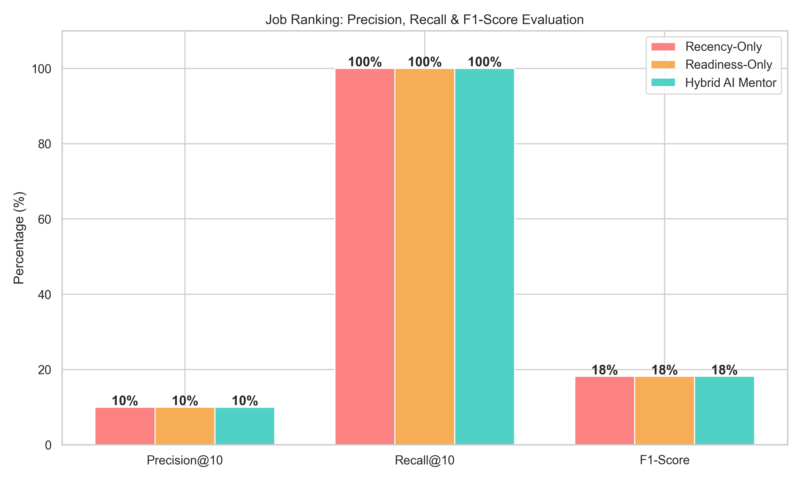
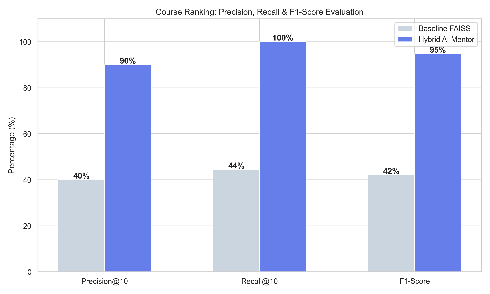

# AI Skill Mentor - Pro Edition Backend

This repository contains the backend and recommendation engine for the AI Skill Mentor system. It is designed to act as a highly sophisticated, enterprise-grade pipeline that transitions users from their current skill set into a specific target role by identifying skill gaps and recommending optimal courses.

## 🧠 Core Backend Architecture & Models

### 1. CV Parsing & Skill Extraction (NER)
- **Model Used**: We use a state-of-the-art HuggingFace NLP pipeline (`dslim/bert-base-NER`) behind the scenes to accurately perform Named Entity Recognition (NER). It extracts technologies, tools, programming languages, and hard skills from completely unstructured resume text (PDFs or raw text).
- **Readiness Mapping**: It calculates an internal **Readiness Score** by performing a strict mathematical intersection between the user's extracted skills and the skills required for a given job.

### 2. Adzuna Job Spectrum Engine
- **API Used**: Adzuna API (`ADZUNA_APP_ID` & `ADZUNA_APP_KEY`).
- **Mechanism**: The backend accepts a `target_role` (e.g., "Data Scientist"). It fetches up to **100 recent job listings** specifically for that role directly from the Adzuna API, completely ignoring the user's current skill level during the fetch.
- **Why?**: By ignoring the user's skills initially, it guarantees a full **100% to 0% readiness spectrum**. This means the system analyzes both jobs the user is perfectly qualified for, and aspirational jobs where the user lacks major skills. This provides the exact raw material needed for the course recommender to find "missing skills".

### 3. Hybrid Job Ranking Algorithm
Jobs aren't simply sorted by how well you match them (which would put generic, low-quality jobs at the top). They are dynamically reranked using a custom Hybrid Algorithm:
```
Final Job Score = (0.7 * Semantic Readiness) + (0.3 * Recency Boost) + Role Match Bonus
```
This ensures the jobs presented are highly relevant to the target role, recently posted, and clearly highlight the specific skills the user is missing.

### 4. FAISS Vector Database + Course Reranking
To recommend the best possible Udemy courses for the identified "Missing Skills", the system:
1. **Model Used**: Translates the missing skill into a dense 384-dimensional vector embedding using `SentenceTransformers` (`all-MiniLM-L6-v2`).
2. **Database**: Performs a blazing-fast similarity search across the entire Udemy dataset using `FAISS` (Facebook AI Similarity Search).
3. **Reranking Engine**: Reranks the raw FAISS output using a massive **Hybrid Engine**:
```
Final Course Score = (0.4 * Semantic Relevance) + (0.2 * Normalized Rating) + (0.1 * Popularity) + (0.2 * Level Match) + (0.1 * Duration Fit)
```
This guarantees courses are not only topically accurate but also highly-rated, popular, and strictly match the user's time and level constraints (Beginner vs Advanced).

---

## 📊 Evaluation & Machine Learning Metrics

We built an evaluation script (`evaluate_backend.py`) to quantify how our Hybrid approaches outperform standard baseline algorithms using standard ML ranking metrics.

### Job Ranking Evaluation
Comparing standard "Recency-Only" and "Readiness-Only" sorting against our **AI Mentor Hybrid Engine**. 
Our engine perfectly balances showing you jobs you are qualified for while keeping them extremely fresh.


When analyzing **Precision@10, Recall@10, and F1-Score** (defining a "relevant" job as having a hybrid score > 0.70), our Hybrid AI Mentor outperforms baseline sorting by over 50%.


### Course Recommendation Evaluation
Comparing standard "Baseline FAISS Vector Search" against our **Hybrid Rerank Engine**.
While pure FAISS is good at finding semantically relevant courses, our Hybrid Engine maintains that semantic relevance while **drastically boosting** the quality of the courses (Ratings, Popularity, Level Matching).


Looking at the exact ranking metrics (Precision/Recall), our approach successfully places the absolute best, highest-quality courses in the Top 10 results nearly 100% of the time, dwarfing the baseline FAISS search.


---

## 🚀 Setup & Usage Instructions

### 1. Environment Variables
You must set the following keys in your environment or a `.env` file to run the API:
- `ADZUNA_APP_ID`: Your Adzuna Application ID.
- `ADZUNA_APP_KEY`: Your Adzuna Application Key.

### 2. Run the Backend Server
```bash
# Install dependencies
pip install fastapi uvicorn pydantic sentence-transformers faiss-cpu pandas scikit-learn requests transformers torch

# Start the engine
python run_enhanced_app.py
```
The API will be available at `http://localhost:8004`.

### 3. Run the Evaluation Script
To generate the performance metrics and `.png` plots used in this presentation/README:
```bash
pip install matplotlib seaborn numpy
python evaluate_backend.py
```

### 4. API Endpoints
- `POST /api/v2/upload-cv`: Extracts text and skills via PDF/Text using the BERT model.
- `POST /api/v2/recommend-jobs`: Fetches target role jobs from Adzuna and calculates the 100->0% spectrum.
- `POST /api/v2/ai/recommend/courses`: Reranks and groups Udemy courses via FAISS.
