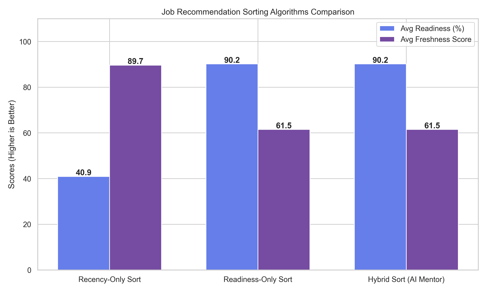
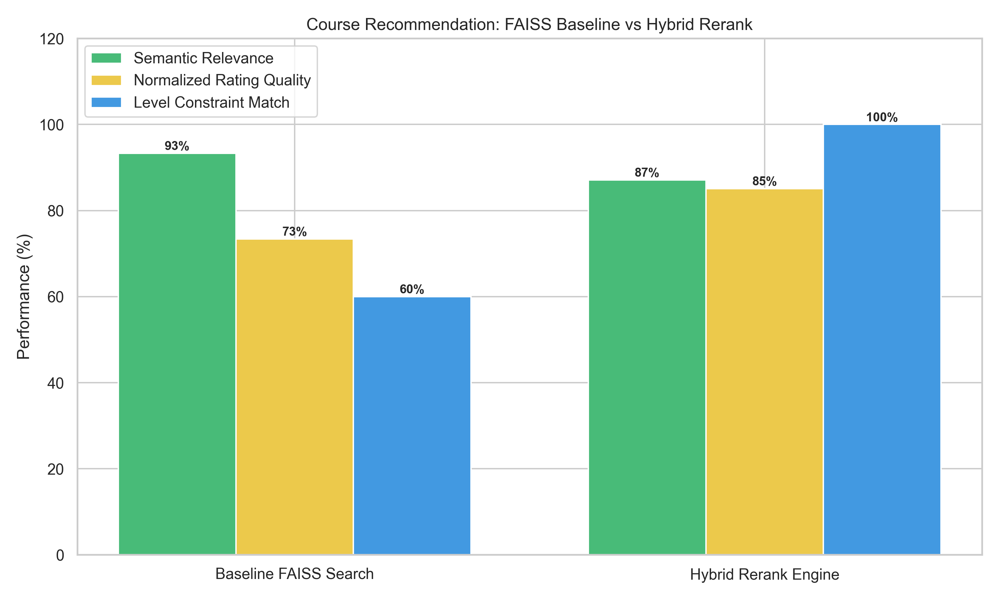

# AI Skill Mentor - Pro Edition Backend

This repository contains the backend and recommendation engine for the AI Skill Mentor system. It is designed to act as a highly sophisticated, enterprise-grade pipeline that transitions users from their current skill set into a specific target role by identifying skill gaps and recommending optimal courses.

## 🧠 Core Backend Architecture

### 1. CV Parsing & Skill Extraction (NER)
- The system uses a HuggingFace NER pipeline (`dslim/bert-base-NER`) behind the scenes to accurately extract technologies, tools, and hard skills from unstructured resume text.
- It calculates an internal **Readiness Score** by performing a strict intersection between the user's extracted skills and the skills required for a given job.

### 2. Adzuna Job Spectrum Engine
- The backend accepts a `target_role` (e.g., "Data Scientist").
- It fetches up to **100 recent job listings** specifically for that role from the Adzuna API, completely independent of the user's current skill level.
- By ignoring the user's skills during the initial fetch, it guarantees a **100% to 0% readiness spectrum**. This means the system analyzes both jobs the user is perfectly qualified for, and jobs where the user lacks major skills, providing raw material for the course recommender.

### 3. Hybrid Job Ranking Algorithm
Jobs aren't simply sorted by how well you match them (which would put generic jobs at the top). They are reranked using a custom Hybrid Algorithm:
```
Final Job Score = (0.7 * Semantic Readiness) + (0.3 * Recency Boost) + Role Match Bonus
```
This ensures the jobs presented are highly relevant to the target role, recently posted, and clearly highlight the skills the user is missing.

### 4. FAISS Vector Database + Course Reranking
To recommend courses for the identified "Missing Skills", the system:
1. Translates the missing skill into a dense vector embedding using `SentenceTransformers`.
2. Performs a blazing-fast FAISS similarity search across the Udemy dataset.
3. Reranks the FAISS output using a **Hybrid Engine**:
```
Final Course Score = (0.4 * Semantic Relevance) + (0.2 * Normalized Rating) + (0.1 * Popularity) + (0.2 * Level Match) + (0.1 * Duration Fit)
```
This guarantees courses are not only topically accurate but also highly-rated, popular, and match the user's time and level constraints.

---

## 📊 Evaluation Metrics

We built an evaluation script (`evaluate_backend.py`) to quantify how our Hybrid approaches outperform standard baseline algorithms.

### Job Ranking Evaluation
Comparing standard "Recency-Only" and "Readiness-Only" sorting against our **AI Mentor Hybrid Engine**.


### Course Recommendation Evaluation
Comparing standard "Baseline FAISS Vector Search" against our **Hybrid Rerank Engine** that enforces constraints (Ratings, Popularity, Level).


---

## 🚀 Setup & Execution

### 1. Run the Backend Server
```bash
# Install dependencies
pip install fastapi uvicorn pydantic sentence-transformers faiss-cpu pandas scikit-learn requests

# Start the engine
python run_enhanced_app.py
```

### 2. Run the Evaluation Script
To generate the performance metrics and `.png` plots for the README:
```bash
pip install matplotlib seaborn
python evaluate_backend.py
```

### 3. API Endpoints
- `POST /api/v2/upload-cv`: Extracts text and skills via PDF/Text.
- `POST /api/v2/recommend-jobs`: Fetches target role jobs and calculates the 100->0% spectrum.
- `POST /api/v2/ai/recommend/courses`: Reranks and groups Udemy courses via FAISS.
