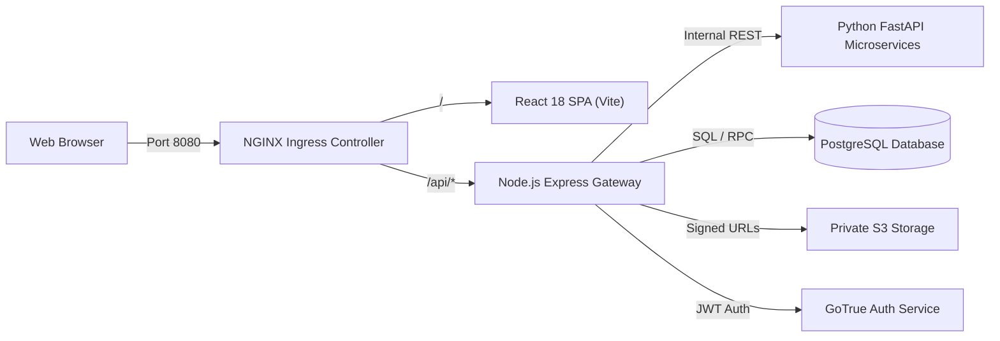

# Recruiter System Architecture

This document provides a comprehensive technical overview of the system architecture supporting the Recruiter workflow in the **AI Skill Mentor** platform.

Related Documents:
- [End-to-End Data Flow](file:///d:/Grad/Repo/AI-Skill-Mentor-Job-Seekers/docs/recruiter/02-recruiter-end-to-end-data-flow.md)
- [API Specification](file:///d:/Grad/Repo/AI-Skill-Mentor-Job-Seekers/docs/recruiter/03-recruiter-api-specification.md)
- [Feature Architecture](file:///d:/Grad/Repo/AI-Skill-Mentor-Job-Seekers/docs/recruiter/04-recruiter-feature-architecture.md)
- [Database / Data Model](file:///d:/Grad/Repo/AI-Skill-Mentor-Job-Seekers/docs/recruiter/05-recruiter-database-data-model.md)
- [AI Architecture](file:///d:/Grad/Repo/AI-Skill-Mentor-Job-Seekers/docs/recruiter/06-recruiter-ai-architecture.md)
- [Security & Authorization](file:///d:/Grad/Repo/AI-Skill-Mentor-Job-Seekers/docs/recruiter/07-recruiter-security-authorization.md)
- [Deployment & Infrastructure](file:///d:/Grad/Repo/AI-Skill-Mentor-Job-Seekers/docs/recruiter/08-recruiter-deployment-infrastructure.md)
- [Testing & Validation](file:///d:/Grad/Repo/AI-Skill-Mentor-Job-Seekers/docs/recruiter/09-recruiter-testing-validation.md)
- [Architecture Diagrams](file:///d:/Grad/Repo/AI-Skill-Mentor-Job-Seekers/docs/recruiter/diagrams/system-architecture.md)

---

## 1. Overview

The Recruiter Web Application is an enterprise module within the AI Skill Mentor platform that enables talent acquisition teams, recruiters, and hiring managers to:
1. Maintain their organization's company profile.
2. Author, publish, modify, and manage active job listings.
3. Discover pre-analyzed job seeker candidates across the platform through AI-driven semantic and skill matching.
4. Review direct inbound job applications from job seekers.
5. Securely inspect candidate resumes via short-lived signed storage tokens.
6. Initiate outreach to top candidate matches while upholding data privacy and multi-tenant security boundaries.

---

## 2. High-Level Architecture

The platform follows a decoupled, service-oriented architecture deployed on Kubernetes (Minikube in development/staging, standard K8s in production):



### Network Traffic Invariant
- **Single Public Entrypoint**: All client browser traffic reaches the system via the NGINX Ingress Controller at `http://localhost:8080`.
- **Route Split**:
  - `/*` routes to the React 18 Single-Page Application (`frontend-service:80`).
  - `/api/*` routes to the Express REST API Gateway (`express-backend-service:5000`).
- **Internal AI Mesh**: AI microservices are isolated inside the Kubernetes cluster network (`ClusterIP`) and are never directly exposed to the public internet or the client browser.

---

## 3. Core Subsystems

| Subsystem | Technology | Repository Path | Primary Responsibility |
| :--- | :--- | :--- | :--- |
| **Frontend UI** | React 18, TypeScript, Vite, Tailwind CSS | [Frontend-React](file:///d:/Grad/Repo/AI-Skill-Mentor-Job-Seekers/Frontend-React) | Provides the Recruiter Dashboard, Job Creation wizard, Candidate Match Viewer, and Applicant review modals. |
| **API Gateway & Backend** | Node.js (v24), Express.js | [backend](file:///d:/Grad/Repo/AI-Skill-Mentor-Job-Seekers/backend) | Handles JWT authentication, request routing, role-based authorization, rate limiting, and business workflows. |
| **CV Matching Microservice** | Python 3.13, FastAPI, SentenceTransformers, FuzzyWuzzy | [cv_matching_service](file:///d:/Grad/Repo/AI-Skill-Mentor-Job-Seekers/AI-Microservices/cv_matching_service) | Evaluates text and skill similarity between job descriptions and batches of candidates, producing canonical percentage scores. |
| **Database & Auth Engine** | Supabase (Cloud PostgreSQL 15, GoTrue, S3 Storage) | [database_setup.sql](file:///d:/Grad/Repo/AI-Skill-Mentor-Job-Seekers/database_setup.sql) | Stores user records, job postings, candidate matches, applications, and manages Row Level Security (RLS) policies. |
| **Kubernetes Orchestration** | Kubernetes v1.32, Minikube, NGINX Ingress | [k8s](file:///d:/Grad/Repo/AI-Skill-Mentor-Job-Seekers/k8s) | Manages Pod lifecycles, health probes, service discovery, internal networking, and self-healing. |

---

## 4. Frontend Architecture

The frontend is a single-page application built with modern React functional components and hooks:

```text
Frontend-React/src/
├── components/
│   ├── RecruiterProfile.tsx     # Main Recruiter Dashboard & Management Hub
│   ├── JobPosting.tsx           # Job Creation Wizard & Validation
│   ├── JobsListing.tsx          # Public / Platform Jobs Directory
│   ├── JobDetails.tsx           # Single Job View & Application Submission
│   ├── Navigation.tsx           # Global Role-Based Navigation & Notifications
│   ├── Login.tsx                # Credential Authentication
│   └── SignUp.tsx               # Account Registration with Role Selection
├── context/
│   └── AuthContext.tsx          # Global JWT, Session State, & Role Guard
└── api/
    ├── apiClient.js             # Base fetch wrapper with 401 interceptor
    ├── auth.api.js              # Signup, Login, Logout, Verify
    ├── jobs.api.js              # Job CRUD, AI Matching, Applicants, Signed URLs
    ├── recruiterProfile.api.js  # Company Profile GET/PUT
    └── notifications.api.js     # Recruiter Notification Polling
```

### State & Session Management
- **AuthContext**: Maintains `user`, `token`, and `isAuthenticated` states in memory, hydrated from `localStorage`.
- **401 Response Interceptor**: When an API returns `HTTP 401 Unauthorized`, `apiClient.js` clears corrupted storage keys and prevents recursive request loops.
- **Role-Based UI Rendering**: Hides job seeker features (e.g., resume upload, skill gap analysis) from recruiters and hides recruiter management buttons from seekers.

---

## 5. Backend Architecture

The backend follows an enterprise layered architecture:

```text
backend/src/
├── routes/                      # Route definitions & HTTP verb bindings
│   ├── auth.routes.js           # /api/auth/*
│   ├── jobs.routes.js           # /api/jobs/*
│   ├── companyProfile.routes.js # /api/recruiter/company-profile
│   └── notifications.routes.js  # /api/notifications
├── controllers/                 # HTTP Request/Response Orchestrators
│   ├── auth.controller.js
│   ├── jobs.controller.js
│   ├── companyProfile.controller.js
│   └── notifications.controller.js
├── services/                    # Domain Business Logic
│   └── recruiterMatching.service.js # AI matching orchestration & batching
├── repositories/                # Data Access & Database Queries
│   ├── candidatePool.repository.js  # Eligible discoverable seeker extraction
│   ├── recruiterMatches.repository.js # Atomic RPC persistence & sync
│   ├── jobRecommendations.repository.js
│   └── companyProfile.repository.js
├── middlewares/                 # Cross-Cutting Concerns
│   ├── auth.middleware.js       # JWT extraction & signature verification
│   ├── roles.middleware.js      # Role-based access control (RBAC)
│   └── rateLimit.middleware.js  # Throttling expensive operations
└── config/
    └── supabase.js              # Supabase Client & Service Role Admin
```

---

## 6. AI Microservices Mesh

The platform features 7 Python microservices running FastAPI. The Recruiter cycle interacts primarily with:

1. **`cv-matching-service` (Port `8003`)**:
   - Accepts batches of candidate profile summaries (skills, experience, education) and the target job description.
   - Evaluates syntactic and semantic skill overlaps using FuzzyWuzzy matching and string similarity.
   - Returns a structured array of `rankedCandidates` with canonical `score` values in the range `[0.0, 100.0]`.

2. **`skill-normalization-service` (Port `8002`)**:
   - Normalizes raw skills extracted from resumes into standard taxonomy tokens during candidate onboarding.

---

## 7. Storage and External Services

- **Supabase GoTrue**: Manages encrypted user passwords and session JWTs.
- **Supabase PostgreSQL**: Relational database with automated database triggers for profile initialization.
- **Supabase Storage (`resumes` bucket)**: Private S3-compatible storage. Raw PDF/DOCX resumes are stored in private directories and accessed strictly through presigned temporary URLs generated on-demand by the backend.
