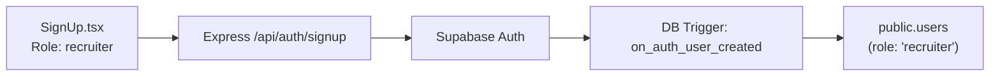
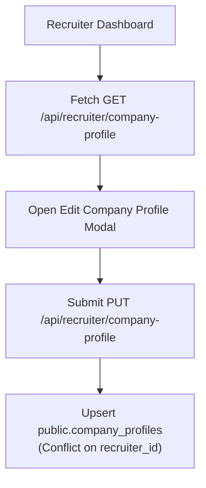
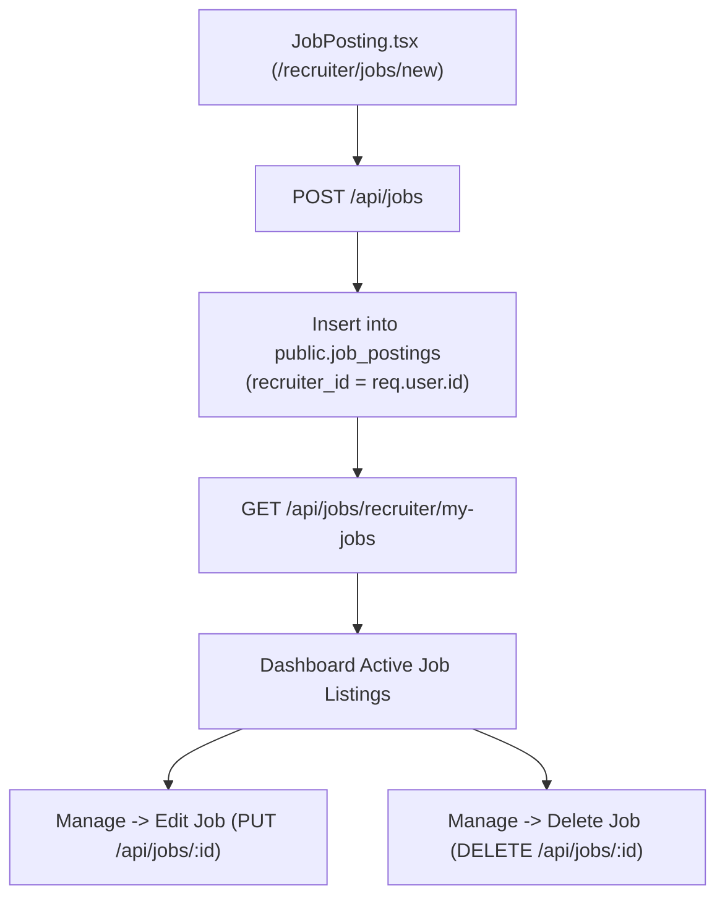
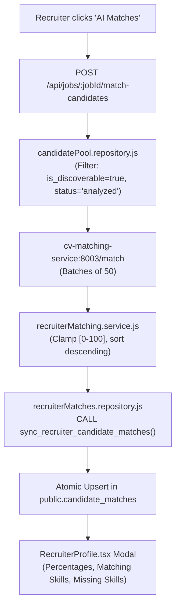
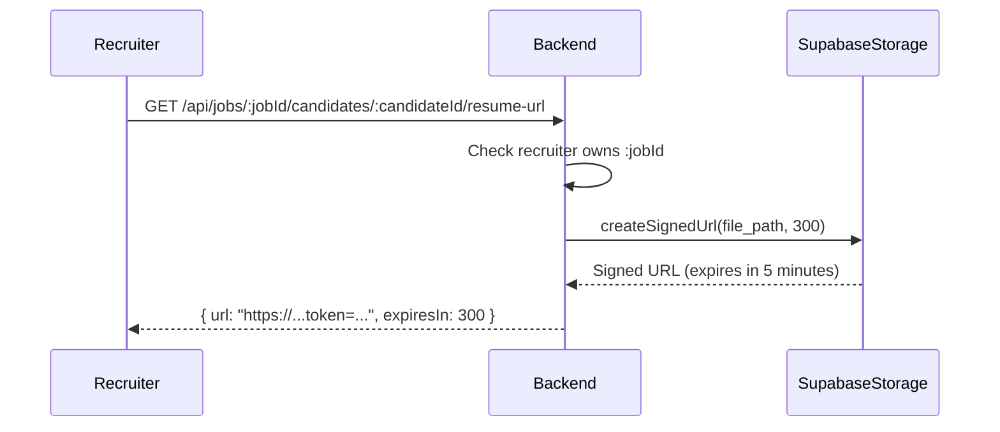

# Recruiter Feature Architecture

This document details the functional specifications, internal workflows, data transformations, and business rules governing each user-facing feature in the Recruiter Web Application.

Related Documents:
- [System Architecture](file:///d:/Grad/Repo/AI-Skill-Mentor-Job-Seekers/docs/recruiter/01-recruiter-system-architecture.md)
- [API Specification](file:///d:/Grad/Repo/AI-Skill-Mentor-Job-Seekers/docs/recruiter/03-recruiter-api-specification.md)
- [AI Architecture](file:///d:/Grad/Repo/AI-Skill-Mentor-Job-Seekers/docs/recruiter/06-recruiter-ai-architecture.md)
- [Security & Authorization](file:///d:/Grad/Repo/AI-Skill-Mentor-Job-Seekers/docs/recruiter/07-recruiter-security-authorization.md)

---

## 1. Authentication & Role-Based Access Control

### Functional Overview
The platform supports multi-role self-registration for `job_seeker` and `recruiter` personas.



### Key Behaviors
- **Role Invariant**: When an account is registered with role `recruiter`, backend and database constraints assign the user to the `recruiter` role.
- **Route Guarding**: Unauthenticated visits to `/recruiter/*` are intercepted by React Router in `App.tsx` and redirected to `/signin`.
- **Session Refresh**: Token expiry is handled transparently by `apiClient.js`. If a token is invalidated, the client safely resets local auth state without entering recursive 401 error loops.

---

## 2. Recruiter Company Profile

### Functional Overview
Recruiters maintain an organizational profile summarizing their company background, hiring focus, and contact channels.



### Displayed & Managed Fields
- `name`: Organization name (e.g. "Nexus Solutions").
- `description`: Overview of business and hiring domain.
- `email`: Public talent contact email.
- `phone`: Contact telephone number.
- `location`: Headquarters or primary hiring region.

---

## 3. Job Management (CRUD)

### Functional Overview
Recruiters author and manage active postings directly from their dashboard.



### Business Rules
- **Automatic Ownership Binding**: The creating recruiter's UUID (`req.user.id`) is bound to `job_postings.recruiter_id`.
- **Ownership Verification (BOLA Defense)**: Any modification (`PUT`) or deletion (`DELETE`) verifies that `job.recruiter_id === req.user.id`. Cross-recruiter tampering yields `HTTP 403 Forbidden`.

---

## 4. AI Candidate Discovery & Matching

### Functional Overview
Recruiters can trigger on-demand semantic candidate matching for any owned job posting to discover eligible job seekers across the platform.



### Core Invariants
- **Canonical Percentage Display**: Scores are formatted as clean integer or one-decimal percentages (e.g., `88%` or `92.5%`). Never displayed as `NaN%`, negative numbers, or raw decimals like `0.88`.
- **Zero [object Object]**: Skills, missing skills, and experience are rigorously unwrapped and rendered into clean badge UI elements.

---

## 5. Candidate Matches vs. Direct Applications

An essential architectural invariant of the platform is the distinction between AI candidate discovery and direct job seeker applications:

```text
┌────────────────────────────────────────────────────────┐
│                   CANDIDATE POOL                       │
│  (Platform-wide discoverable seekers with resumes)     │
└──────────────────────────┬─────────────────────────────┘
                           │
             ┌─────────────┴─────────────┐
             ▼                           ▼
┌─────────────────────────┐ ┌─────────────────────────┐
│    candidate_matches    │ │    job_applications     │
│   (AI Discovery Pool)   │ │  (Direct Inbound Apply) │
│                         │ │                         │
│ • Generated by AI       │ │ • Created by Job Seeker │
│ • Sourced from pool     │ │ • Explicit user intent  │
│ • Does NOT imply apply  │ │ • Attached resume snapshot
└─────────────────────────┘ └─────────────────────────┘
```

| Dimension | `candidate_matches` | `job_applications` |
| :--- | :--- | :--- |
| **Initiated By** | Recruiter triggering AI Discovery | Job Seeker clicking "Apply Now" |
| **User Action** | None required from candidate | Explicit submission by candidate |
| **Database Table** | `public.candidate_matches` | `public.job_applications` |
| **UI Presentation** | "AI Matches" Modal | "Applicants" Modal |

---

## 6. Secure Candidate Resume Access

### Functional Overview
Recruiters inspect candidate resumes via tokenized, short-lived storage URLs without exposing public read permissions to private storage buckets.



- **Expiration Time**: Signed URLs expire after 300 seconds (5 minutes).
- **Public Bucket Policy**: Direct public access to the `resumes` bucket is blocked by Supabase Storage RLS policies.

---

## 7. Candidate Contact & Outreach

### Functional Overview
Recruiters can draft and send outreach notes to top matching candidates.
- **Implementation Reality**: The system records the contact message in the platform database and logs the recruiter interaction.
- *Notice*: The current release records outreach requests for auditing and does not execute external SMTP email delivery.

---

## 8. In-App Notifications

### Functional Overview
In-app notifications alert recruiters when new applications are submitted or system updates occur.
- **Polling Rhythm**: `Navigation.tsx` queries `GET /api/notifications` every 30 seconds while authenticated.
- **Fail-Safe Polling**: If the session expires, the polling loop catches HTTP 401 and stops silently, eliminating browser freeze and console flood.
