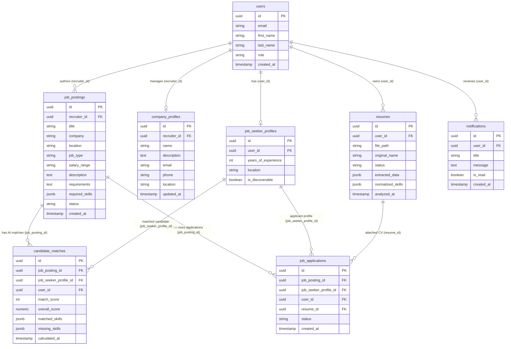

# Recruiter Database & Data Model

This document specifies the relational data model, database schema, entity relationships, and Row Level Security (RLS) policies relevant to the Recruiter Web Application in PostgreSQL / Supabase.

Related Documents:
- [System Architecture](file:///d:/Grad/Repo/AI-Skill-Mentor-Job-Seekers/docs/recruiter/01-recruiter-system-architecture.md)
- [API Specification](file:///d:/Grad/Repo/AI-Skill-Mentor-Job-Seekers/docs/recruiter/03-recruiter-api-specification.md)
- [Feature Architecture](file:///d:/Grad/Repo/AI-Skill-Mentor-Job-Seekers/docs/recruiter/04-recruiter-feature-architecture.md)
- [Security & Authorization](file:///d:/Grad/Repo/AI-Skill-Mentor-Job-Seekers/docs/recruiter/07-recruiter-security-authorization.md)

---

## 1. Entity-Relationship Diagram (ERD)



---

## 2. Table Schemas & Constraints

### 2.1 `public.job_postings`
Stores all job listings authored by recruiters or admins.
| Column | Type | Nullable | Constraints & Description |
| :--- | :--- | :---: | :--- |
| `id` | `UUID` | No | Primary Key, `DEFAULT gen_random_uuid()` |
| `recruiter_id` | `UUID` | No | Foreign Key -> `auth.users(id)` ON DELETE CASCADE |
| `title` | `TEXT` | No | Job position title |
| `company` | `TEXT` | Yes | Organization display name |
| `location` | `TEXT` | Yes | Location / Remote policy |
| `job_type` | `TEXT` | Yes | E.g. `full_time`, `part_time`, `contract` |
| `salary_range` | `TEXT` | Yes | Formatted compensation range |
| `description` | `TEXT` | No | Full job description text |
| `requirements` | `TEXT` | Yes | Candidate prerequisites |
| `required_skills` | `JSONB` | Yes | Array of skill strings (e.g. `["React", "Node.js"]`) |
| `status` | `TEXT` | No | Default: `'open'` (`'open'`, `'closed'`) |
| `created_at` | `TIMESTAMPTZ` | No | Default: `now()` |

---

### 2.2 `public.candidate_matches`
Stores AI-computed matching metrics for candidates against specific jobs.
| Column | Type | Nullable | Constraints & Description |
| :--- | :--- | :---: | :--- |
| `id` | `UUID` | No | Primary Key, `DEFAULT gen_random_uuid()` |
| `job_posting_id` | `UUID` | No | Foreign Key -> `job_postings(id)` ON DELETE CASCADE |
| `job_seeker_profile_id` | `UUID` | Yes | Foreign Key -> `job_seeker_profiles(id)` |
| `user_id` | `UUID` | Yes | Foreign Key -> `auth.users(id)` ON DELETE CASCADE |
| `match_score` | `INT` | No | Integer match percentage `[0, 100]` |
| `overall_score` | `NUMERIC` | Yes | Decimal representation `[0.0, 1.0]` |
| `matched_skills` | `JSONB` | Yes | Array of matched skill strings |
| `missing_skills` | `JSONB` | Yes | Array of missing skill strings |
| `calculated_at` | `TIMESTAMPTZ` | No | Timestamp of the AI matching run |

**Unique Constraint**: `UNIQUE(job_posting_id, job_seeker_profile_id)` ensures idempotent match scoring per candidate per job.

---

### 2.3 `public.job_applications`
Tracks explicit candidate job applications.
| Column | Type | Nullable | Constraints & Description |
| :--- | :--- | :---: | :--- |
| `id` | `UUID` | No | Primary Key, `DEFAULT gen_random_uuid()` |
| `job_posting_id` | `UUID` | No | Foreign Key -> `job_postings(id)` ON DELETE CASCADE |
| `user_id` | `UUID` | No | Foreign Key -> `auth.users(id)` ON DELETE CASCADE |
| `job_seeker_profile_id` | `UUID` | Yes | Foreign Key -> `job_seeker_profiles(id)` |
| `resume_id` | `UUID` | Yes | Foreign Key -> `resumes(id)` |
| `status` | `TEXT` | No | Default: `'applied'` (`'applied'`, `'reviewed'`, `'rejected'`) |
| `created_at` | `TIMESTAMPTZ` | No | Timestamp of candidate application |

**Unique Constraint**: `UNIQUE(job_posting_id, user_id)` prevents duplicate applications to the same job.

---

### 2.4 `public.company_profiles`
Stores organizational metadata for recruiters.
| Column | Type | Nullable | Constraints & Description |
| :--- | :--- | :---: | :--- |
| `id` | `UUID` | No | Primary Key, `DEFAULT gen_random_uuid()` |
| `recruiter_id` | `UUID` | No | Unique Foreign Key -> `auth.users(id)` ON DELETE CASCADE |
| `name` | `TEXT` | No | Organization name |
| `description` | `TEXT` | Yes | Company summary |
| `email` | `TEXT` | Yes | Talent contact email |
| `phone` | `TEXT` | Yes | Contact phone number |
| `location` | `TEXT` | Yes | Headquarters location |
| `updated_at` | `TIMESTAMPTZ` | No | Default: `now()` |

---

## 3. Database Functions & Stored Procedures (RPC)

### `sync_recruiter_candidate_matches`
```sql
CREATE OR REPLACE FUNCTION public.sync_recruiter_candidate_matches(
    p_job_id UUID,
    p_matches JSONB,
    p_calculated_at TIMESTAMPTZ
) RETURNS JSONB ...
```
- **Execution**: Atomic, fail-closed transaction.
- **Behavior**:
  1. Upserts all candidate records from `p_matches` into `public.candidate_matches`.
  2. Deletes any existing rows for `p_job_id` that are absent from the newly computed `p_matches` payload (stale candidate pruning).
  3. Returns `{ "success": true, "upserted_count": N }`.

---

## 4. Row Level Security (RLS) Policies

All database tables have Row Level Security enabled (`ALTER TABLE ... ENABLE ROW LEVEL SECURITY`).

- **`job_postings`**:
  - `SELECT`: Allowed for all authenticated users (job discovery) and public visitors.
  - `INSERT`: Restricted to authenticated users with role `recruiter` or `admin`.
  - `UPDATE` / `DELETE`: Enforces `recruiter_id = auth.uid()` or role `admin`.
- **`company_profiles`**:
  - `SELECT`: Public / Authenticated.
  - `INSERT` / `UPDATE`: Restricted to `recruiter_id = auth.uid()`.
- **`candidate_matches`**:
  - `SELECT`: Restricted to job owner (`recruiter_id = auth.uid()`) or the matched job seeker (`user_id = auth.uid()`).
  - `INSERT` / `UPDATE`: Backend service role (`supabaseAdmin`).
