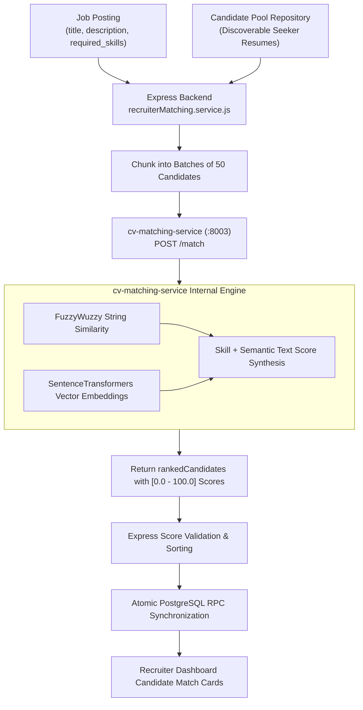

# Recruiter AI Architecture & Pipeline

This document specifies the architecture, data inputs, similarity algorithms, microservice contracts, and validation invariants of the AI Candidate Discovery pipeline.

Related Documents:
- [System Architecture](file:///d:/Grad/Repo/AI-Skill-Mentor-Job-Seekers/docs/recruiter/01-recruiter-system-architecture.md)
- [API Specification](file:///d:/Grad/Repo/AI-Skill-Mentor-Job-Seekers/docs/recruiter/03-recruiter-api-specification.md)
- [Feature Architecture](file:///d:/Grad/Repo/AI-Skill-Mentor-Job-Seekers/docs/recruiter/04-recruiter-feature-architecture.md)
- [Database / Data Model](file:///d:/Grad/Repo/AI-Skill-Mentor-Job-Seekers/docs/recruiter/05-recruiter-database-data-model.md)

---

## 1. AI Pipeline Overview

The AI Candidate Discovery pipeline bridges structured job postings with platform candidate resumes using natural language processing (NLP), taxonomy normalization, and semantic text similarity.



---

## 2. Pipeline Inputs & Data Sources

### 2.1 Job Description Synthesis
The backend synthesizes a comprehensive job profile text from the `job_postings` record:
```javascript
const jobDescriptionParts = [
  job.title ? `Job Title: ${job.title}` : null,
  job.job_description || job.description || null,
  requiredSkillsArr.length > 0 ? `Required Skills: ${requiredSkillsArr.join(', ')}` : null,
  job.location ? `Location: ${job.location}` : null,
].filter(Boolean);

const jobDescriptionText = jobDescriptionParts.join('\n\n');
```

### 2.2 Candidate Pool Eligibility
`candidatePool.repository.js` extracts candidates based on strict criteria:
1. `users.role = 'job_seeker'`
2. `job_seeker_profiles.is_discoverable = true`
3. Candidate has at least one resume with `status = 'analyzed'` and a non-empty `normalized_skills` array.
4. **Privacy Invariant**: PII (email, phone, raw resume file path) is stripped before dispatching candidate batches to the AI microservice.

---

## 3. Microservice Contract (`cv-matching-service`)

### Endpoint
`POST http://cv-matching-service:8003/match`

### Request Schema (`MatchRequest`)
```json
{
  "jobId": "8f3b2024-81eb-4c0a-8e2b-fbc6b0f02781",
  "jobDescription": "Job Title: QA Senior Full Stack Engineer\n\nRequired Skills: JavaScript, React, Node.js, PostgreSQL",
  "candidates": [
    {
      "candidateId": "4392270d-f06b-4e12-881b-c74384a86f91",
      "name": "Alex Taylor",
      "skills": ["JavaScript", "React", "Node.js", "Docker"],
      "experience": 4,
      "education": "B.S. Computer Science"
    }
  ]
}
```

### Response Schema (`MatchResponse`)
```json
{
  "success": true,
  "data": {
    "jobId": "8f3b2024-81eb-4c0a-8e2b-fbc6b0f02781",
    "rankedCandidates": [
      {
        "candidateId": "4392270d-f06b-4e12-881b-c74384a86f91",
        "name": "Alex Taylor",
        "score": 92.5,
        "matchingSkills": ["JavaScript", "React", "Node.js"],
        "missingSkills": ["PostgreSQL"],
        "experience": 4,
        "education": "B.S. Computer Science"
      }
    ]
  },
  "meta": {
    "processingTimeMs": 42
  }
}
```

---

## 4. Score Normalization & Output Invariants

1. **Range Clamping**: The service strictly enforces canonical scores in the range `[0.0, 100.0]`. If an internal model emits a fraction (e.g. `0.925`), it is scaled to `92.5%`.
2. **Defensive Rejection**: Any candidate returned with `NaN`, null, negative scores, or an unrecognized `candidateId` not present in the submitted batch is logged and rejected.
3. **Global Multi-Batch Sorting**: If candidate count exceeds batch size (50), multiple batches are evaluated concurrently and globally sorted by `score DESC` before persistence.
4. **Separation from Job Applications**: Running AI candidate matching writes exclusively to `candidate_matches` and never inserts rows into `job_applications`.
