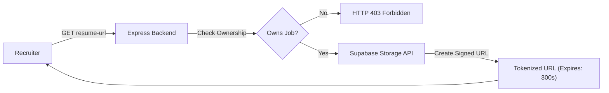

# Recruiter Security & Authorization Architecture

This document specifies the security controls, multi-tenant isolation boundaries, role-based authorization (RBAC), Broken Object-Level Authorization (BOLA / IDOR) defenses, and cryptographic token mechanisms protecting the Recruiter Web Application.

Related Documents:
- [System Architecture](file:///d:/Grad/Repo/AI-Skill-Mentor-Job-Seekers/docs/recruiter/01-recruiter-system-architecture.md)
- [API Specification](file:///d:/Grad/Repo/AI-Skill-Mentor-Job-Seekers/docs/recruiter/03-recruiter-api-specification.md)
- [Feature Architecture](file:///d:/Grad/Repo/AI-Skill-Mentor-Job-Seekers/docs/recruiter/04-recruiter-feature-architecture.md)
- [Database / Data Model](file:///d:/Grad/Repo/AI-Skill-Mentor-Job-Seekers/docs/recruiter/05-recruiter-database-data-model.md)
- [Authorization Flow Diagram](file:///d:/Grad/Repo/AI-Skill-Mentor-Job-Seekers/docs/recruiter/diagrams/authorization-flow.md)

---

## 1. Authentication & JWT Token Handling

Authentication is anchored on Supabase GoTrue with secure JWT tokens.

```text
Client Request
  ├── Headers: Authorization: Bearer <access_token>
  ↓
Express Middleware (auth.middleware.js)
  ├── Extract Bearer Token
  ├── Verify JWT Signature with SUPABASE_JWT_SECRET / supabase.auth.getUser()
  ├── Attach Decoded Claims to req.user (id, email, role)
  ↓
Controller Execution
```

### Session Refresh & Expiration Lifecycle
1. The frontend stores tokens in `localStorage`.
2. When an API call returns `HTTP 401 Unauthorized`:
   - `apiClient.js` intercepts the response.
   - Clears stale tokens from browser storage.
   - Redirects to `/signin` safely.
   - Prevents recursive 401 polling storms.

---

## 2. Multi-Tenant Isolation & BOLA Defense

The platform enforces strict multi-tenant data boundaries between different recruiter accounts:

```text
┌────────────────────────────────────────────────────────┐
│                      RECRUITER R1                      │
│                  (Tenant ID: R1_UUID)                  │
│                                                        │
│   • Can view/edit/delete R1 jobs                       │
│   • Can run AI matching for R1 jobs                    │
│   • Can view applicants for R1 jobs                    │
│   • Can request signed resumes for R1 candidate pool   │
└──────────────────────────┬─────────────────────────────┘
                           │
                 403 FORBIDDEN BOUNDARY
                           │
┌──────────────────────────┴─────────────────────────────┐
│                      RECRUITER R2                      │
│                  (Tenant ID: R2_UUID)                  │
│                                                        │
│   • Attempting GET /jobs/:r1JobId/applicants   -> 403  │
│   • Attempting PUT /jobs/:r1JobId             -> 403  │
│   • Attempting DELETE /jobs/:r1JobId          -> 403  │
│   • Attempting POST /jobs/:r1JobId/match-cands -> 403  │
│   • Attempting GET resume-url for R1 job       -> 403  │
└────────────────────────────────────────────────────────┘
```

### Ownership Verification Pattern
Every job-specific controller implements the following verification check:
```javascript
const { data: job, error: jobErr } = await supabaseAdmin
  .from('job_postings')
  .select('id, recruiter_id')
  .eq('id', jobId)
  .single();

if (jobErr || !job) {
  return res.status(404).json({ error: 'Job not found' });
}

if (req.user.role !== 'admin' && job.recruiter_id !== req.user.id) {
  return res.status(403).json({ error: 'Forbidden: You do not own this job posting' });
}
```

---

## 3. Resume Access Security & Short-Lived Signed URLs

Candidate resumes contain Personally Identifiable Information (PII) and must be safeguarded against unauthorized downloading.



### Security Controls
1. **Private Storage Bucket**: The `resumes` bucket is marked private in Supabase Storage. Direct public URL access returns `403 Access Denied`.
2. **Short Token Lifespan**: Signed URLs generated by `supabaseAdmin.storage.from('resumes').createSignedUrl(path, 300)` automatically expire after 5 minutes (300 seconds).
3. **Auditability**: Requests for candidate resume URLs are throttled by `resumeUrlLimiter` rate limiting middleware.

---

## 4. Frontend vs. Backend Security Model

- **Frontend Filtering is for User Experience (UX)**:
  - Hides buttons, tabs, and modals that do not pertain to the user's role.
  - Improves usability and interface clarity.
- **Backend Authorization is the Security Boundary**:
  - All security checks, role verifications, ownership validations, and rate limits are enforced by backend Express middlewares and controller functions.
  - Bypassing the frontend (e.g. via direct curl or Postman requests) cannot violate authorization or multi-tenant boundaries.
