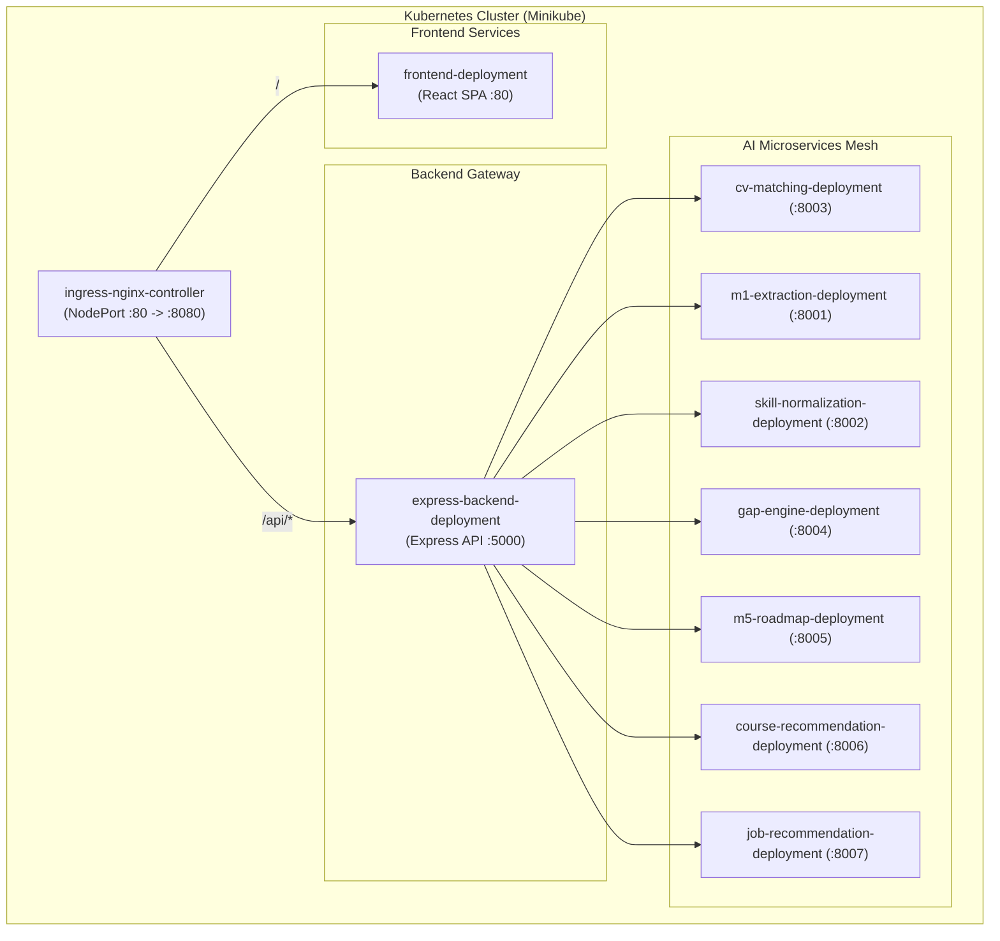

# Recruiter Deployment & Kubernetes Infrastructure

This document details the deployment topology, container specifications, Kubernetes manifests, Ingress configuration, networking, health probes, and runtime management of the platform.

Related Documents:
- [System Architecture](file:///d:/Grad/Repo/AI-Skill-Mentor-Job-Seekers/docs/recruiter/01-recruiter-system-architecture.md)
- [API Specification](file:///d:/Grad/Repo/AI-Skill-Mentor-Job-Seekers/docs/recruiter/03-recruiter-api-specification.md)
- [Testing & Validation](file:///d:/Grad/Repo/AI-Skill-Mentor-Job-Seekers/docs/recruiter/09-recruiter-testing-validation.md)
- [System Architecture Diagram](file:///d:/Grad/Repo/AI-Skill-Mentor-Job-Seekers/docs/recruiter/diagrams/system-architecture.md)

---

## 1. Deployment Topology

The entire application runs as containerized workloads orchestrated by Kubernetes (Minikube in local testing, managed Kubernetes in staging/production):



---

## 2. Kubernetes Resource Manifests

All manifests reside in the [`k8s/`](file:///d:/Grad/Repo/AI-Skill-Mentor-Job-Seekers/k8s) directory:

| File | Resource Types | Description |
| :--- | :--- | :--- |
| [`k8s/ingress.yaml`](file:///d:/Grad/Repo/AI-Skill-Mentor-Job-Seekers/k8s/ingress.yaml) | `Ingress` | Configures NGINX Ingress rules routing `/` to `frontend-service` and `/api` to `express-backend-service`. |
| [`k8s/microservices.yaml`](file:///d:/Grad/Repo/AI-Skill-Mentor-Job-Seekers/k8s/microservices.yaml) | `Deployment`, `Service` | Defines Pod specifications, container ports, CPU/memory requests, and health probes for all 8 backend/AI services. |
| [`k8s/frontend-deployment.yaml`](file:///d:/Grad/Repo/AI-Skill-Mentor-Job-Seekers/k8s/frontend-deployment.yaml) | `Deployment`, `Service` | Deploys the NGINX-served React 18 production bundle on port 80. |
| [`k8s/secrets.yaml`](file:///d:/Grad/Repo/AI-Skill-Mentor-Job-Seekers/k8s/secrets.yaml) | `Secret` | Base64-encoded environment variables (Supabase URL/Key, Groq Key, LLM Keys). |

---

## 3. Ingress Routing & Entrypoint

The application entrypoint is verified on port `8080`:
```text
http://localhost:8080
```

### Ingress Rules Configuration
```yaml
spec:
  ingressClassName: nginx
  rules:
    - http:
        paths:
          - path: /api
            pathType: Prefix
            backend:
              service:
                name: express-backend-service
                port:
                  number: 5000
          - path: /
            pathType: Prefix
            backend:
              service:
                name: frontend-service
                port:
                  number: 80
```

---

## 4. Health Probes & Self-Healing

To support heavyweight AI model loading (SentenceTransformers and NLP pipelines) on CPU without premature container restarts, startup and liveness probes are tuned:

| Service | Probe Type | Endpoint | Initial Delay | Period |
| :--- | :--- | :--- | :---: | :---: |
| `express-backend` | `liveness` | `GET /health` | 10s | 10s |
| `cv-matching-service` | `liveness` | `GET /health` | 30s | 15s |
| `skill-normalization` | `liveness` | `GET /health` | 180s | 30s |
| `m5-roadmap-service` | `liveness` | `GET /health` | 120s | 30s |
| `m1-extraction-service` | `liveness` | `GET /health` | 15s | 15s |

### Self-Healing Validation
When a pod crashes or is deleted via `kubectl delete pod`, the Kubernetes ReplicaSet controller automatically spawns a replacement pod that transitions to `1/1 Running` and rejoins the service mesh within 7 seconds.

---

## 5. Startup & Deployment Commands

### Deploying to Minikube (Recommended)
```powershell
# From repository root
.\k8s\deploy-minikube.ps1
```
This script:
1. Starts the Minikube cluster with adequate memory/CPU.
2. Builds all container images inside the Minikube Docker environment.
3. Enables the `ingress-nginx` addon.
4. Applies ConfigMaps, Secrets, Deployments, Services, and Ingress manifests.

### Port Forwarding for Ingress Access
```powershell
kubectl port-forward -n ingress-nginx svc/ingress-nginx-controller 8080:80
```
The application is then immediately available at `http://localhost:8080`.
