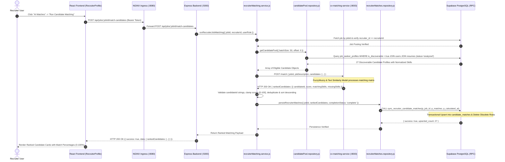

# AI Matching Sequence

This sequence diagram details the AI Candidate Discovery pipeline, from recruiter trigger through candidate pool retrieval, batch evaluation via `cv-matching-service`, score validation, and atomic RPC database persistence.

