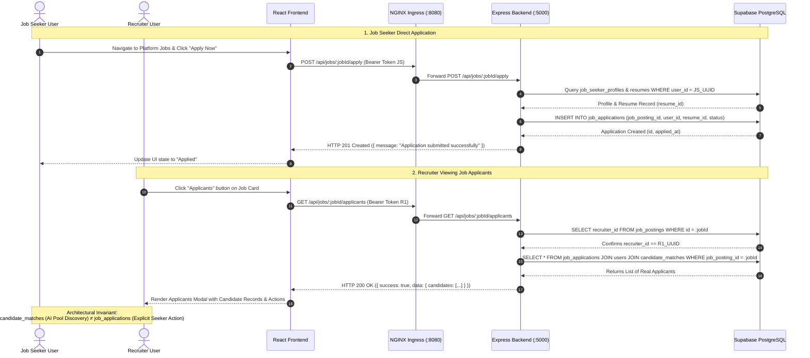

# Applicant Flow Sequence

This sequence diagram illustrates the distinction between an AI candidate discovery match and a direct job application initiated by a Job Seeker.

```mermaid
sequenceDiagram
    autonumber
    actor Seeker as Job Seeker User
    actor Recruiter as Recruiter User
    participant React as React Frontend
    participant Ingress as NGINX Ingress (:8080)
    participant Express as Express Backend (:5000)
    participant Database as Supabase PostgreSQL

    %% Candidate Application Submission
    Note over Seeker,Database: 1. Job Seeker Direct Application
    Seeker->>React: Navigate to Platform Jobs & Click "Apply Now"
    React->>Ingress: POST /api/jobs/:jobId/apply (Bearer Token JS)
    Ingress->>Express: Forward POST /api/jobs/:jobId/apply
    Express->>Database: Query job_seeker_profiles & resumes WHERE user_id = JS_UUID
    Database-->>Express: Profile & Resume Record (resume_id)
    Express->>Database: INSERT INTO job_applications (job_posting_id, user_id, resume_id, status)
    Database-->>Express: Application Created (id, applied_at)
    Express-->>React: HTTP 201 Created ({ message: "Application submitted successfully" })
    React-->>Seeker: Update UI state to "Applied"

    %% Recruiter Reviewing Applicants
    Note over Recruiter,Database: 2. Recruiter Viewing Job Applicants
    Recruiter->>React: Click "Applicants" button on Job Card
    React->>Ingress: GET /api/jobs/:jobId/applicants (Bearer Token R1)
    Ingress->>Express: Forward GET /api/jobs/:jobId/applicants
    Express->>Database: SELECT recruiter_id FROM job_postings WHERE id = :jobId
    Database-->>Express: Confirms recruiter_id == R1_UUID
    Express->>Database: SELECT * FROM job_applications JOIN users JOIN candidate_matches WHERE job_posting_id = :jobId
    Database-->>Express: Returns List of Real Applicants
    Express-->>React: HTTP 200 OK ({ success: true, data: { candidates: [...] } })
    React-->>Recruiter: Render Applicants Modal with Candidate Records & Actions

    %% Key Architecture Invariant
    Note over Seeker,Recruiter: Architectural Invariant:<br/>candidate_matches (AI Pool Discovery) ≠ job_applications (Explicit Seeker Action)
```
