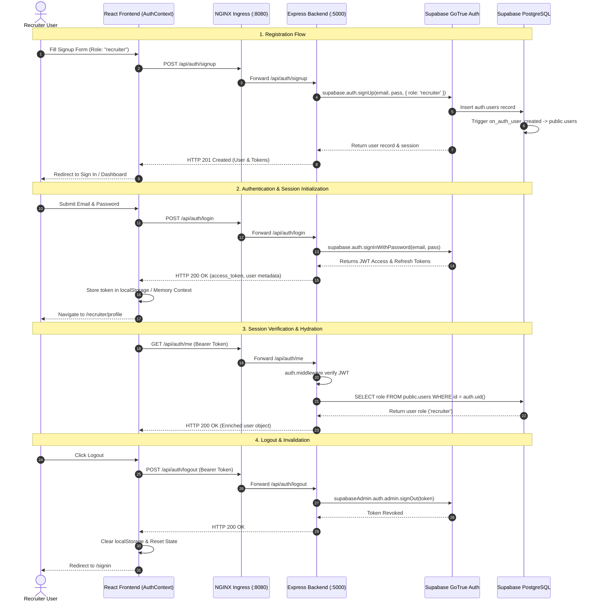

# Authentication Sequence

This sequence diagram illustrates the user registration, credential authentication, session refresh, and token revocation mechanisms for Recruiters.

```mermaid
sequenceDiagram
    autonumber
    actor Recruiter as Recruiter User
    participant React as React Frontend (AuthContext)
    participant Ingress as NGINX Ingress (:8080)
    participant Express as Express Backend (:5000)
    participant SupabaseAuth as Supabase GoTrue Auth
    participant Database as Supabase PostgreSQL

    %% Registration Flow
    Note over Recruiter,Database: 1. Registration Flow
    Recruiter->>React: Fill Signup Form (Role: "recruiter")
    React->>Ingress: POST /api/auth/signup
    Ingress->>Express: Forward /api/auth/signup
    Express->>SupabaseAuth: supabase.auth.signUp(email, pass, { role: 'recruiter' })
    SupabaseAuth->>Database: Insert auth.users record
    Database->>Database: Trigger on_auth_user_created -> public.users
    SupabaseAuth-->>Express: Return user record & session
    Express-->>React: HTTP 201 Created (User & Tokens)
    React-->>Recruiter: Redirect to Sign In / Dashboard

    %% Login Flow
    Note over Recruiter,Database: 2. Authentication & Session Initialization
    Recruiter->>React: Submit Email & Password
    React->>Ingress: POST /api/auth/login
    Ingress->>Express: Forward /api/auth/login
    Express->>SupabaseAuth: supabase.auth.signInWithPassword(email, pass)
    SupabaseAuth-->>Express: Returns JWT Access & Refresh Tokens
    Express-->>React: HTTP 200 OK (access_token, user metadata)
    React->>React: Store token in localStorage / Memory Context
    React-->>Recruiter: Navigate to /recruiter/profile

    %% Session Refresh / Verification
    Note over Recruiter,Database: 3. Session Verification & Hydration
    React->>Ingress: GET /api/auth/me (Bearer Token)
    Ingress->>Express: Forward /api/auth/me
    Express->>Express: auth.middleware verify JWT
    Express->>Database: SELECT role FROM public.users WHERE id = auth.uid()
    Database-->>Express: Return user role ('recruiter')
    Express-->>React: HTTP 200 OK (Enriched user object)

    %% Logout Flow
    Note over Recruiter,Database: 4. Logout & Invalidation
    Recruiter->>React: Click Logout
    React->>Ingress: POST /api/auth/logout (Bearer Token)
    Ingress->>Express: Forward /api/auth/logout
    Express->>SupabaseAuth: supabaseAdmin.auth.admin.signOut(token)
    SupabaseAuth-->>Express: Token Revoked
    Express-->>React: HTTP 200 OK
    React->>React: Clear localStorage & Reset State
    React-->>Recruiter: Redirect to /signin
```
