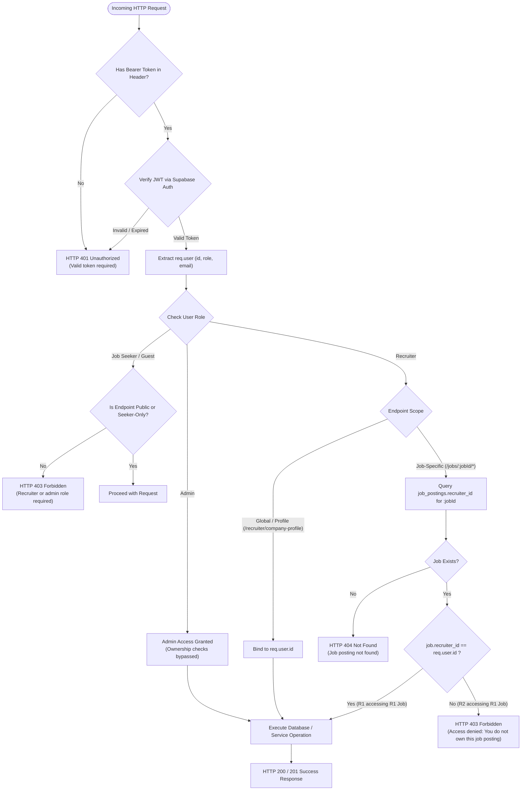

# Authorization Flow & Multi-Tenant Boundary

This flowchart documents the authorization decision tree and cross-tenant isolation enforcement across all Recruiter API endpoints.

```mermaid
flowchart TD
    Start(["Incoming HTTP Request"]) --> TokenCheck{"Has Bearer Token in Header?"}

    TokenCheck -- "No" --> Ret401["HTTP 401 Unauthorized<br/>(Valid token required)"]
    TokenCheck -- "Yes" --> VerifyToken{"Verify JWT via Supabase Auth"}

    VerifyToken -- "Invalid / Expired" --> Ret401
    VerifyToken -- "Valid Token" --> ExtractUser["Extract req.user (id, role, email)"]

    ExtractUser --> RoleCheck{"Check User Role"}
    RoleCheck -- "Job Seeker / Guest" --> DenyRecruiterRole{"Is Endpoint Public or Seeker-Only?"}
    DenyRecruiterRole -- "No" --> Ret403Role["HTTP 403 Forbidden<br/>(Recruiter or admin role required)"]
    DenyRecruiterRole -- "Yes" --> ProceedPublic["Proceed with Request"]

    RoleCheck -- "Admin" --> AdminBypass["Admin Access Granted<br/>(Ownership checks bypassed)"]
    AdminBypass --> ExecDB["Execute Database / Service Operation"]

    RoleCheck -- "Recruiter" --> EndpointType{"Endpoint Scope"}

    EndpointType -- "Global / Profile (/recruiter/company-profile)" --> CheckRecruiterID["Bind to req.user.id"]
    CheckRecruiterID --> ExecDB

    EndpointType -- "Job-Specific (/jobs/:jobId/*)" --> FetchJobOwner["Query job_postings.recruiter_id for :jobId"]
    FetchJobOwner --> JobExists{"Job Exists?"}
    JobExists -- "No" --> Ret404["HTTP 404 Not Found<br/>(Job posting not found)"]

    JobExists -- "Yes" --> OwnershipCheck{"job.recruiter_id == req.user.id ?"}
    OwnershipCheck -- "No (R2 accessing R1 Job)" --> Ret403Ownership["HTTP 403 Forbidden<br/>(Access denied: You do not own this job posting)"]
    OwnershipCheck -- "Yes (R1 accessing R1 Job)" --> ExecDB

    ExecDB --> SuccessResponse["HTTP 200 / 201 Success Response"]
```
