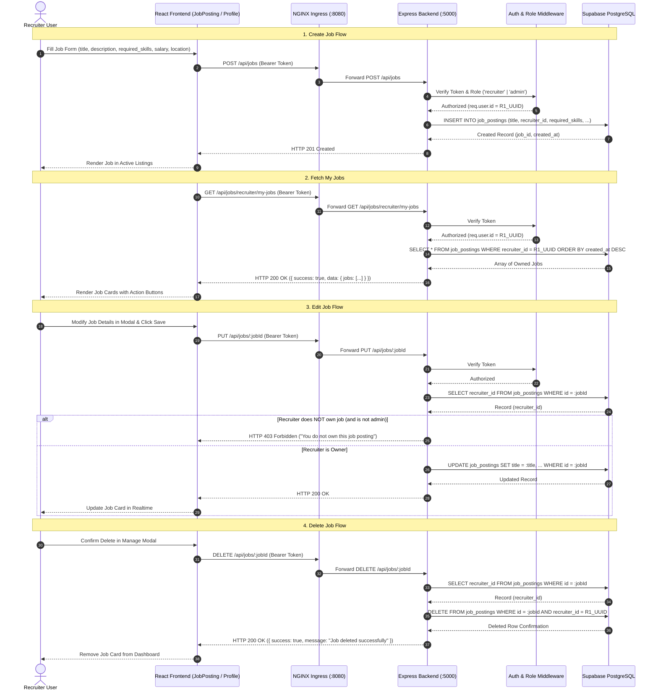

# Job Management Sequence

This sequence diagram details the CRUD operations for job postings, including ownership authorization and database persistence.

```mermaid
sequenceDiagram
    autonumber
    actor Recruiter as Recruiter User
    participant React as React Frontend (JobPosting / Profile)
    participant Ingress as NGINX Ingress (:8080)
    participant Express as Express Backend (:5000)
    participant AuthGuard as Auth & Role Middleware
    participant Database as Supabase PostgreSQL

    %% Create Job
    Note over Recruiter,Database: 1. Create Job Flow
    Recruiter->>React: Fill Job Form (title, description, required_skills, salary, location)
    React->>Ingress: POST /api/jobs (Bearer Token)
    Ingress->>Express: Forward POST /api/jobs
    Express->>AuthGuard: Verify Token & Role ('recruiter' | 'admin')
    AuthGuard-->>Express: Authorized (req.user.id = R1_UUID)
    Express->>Database: INSERT INTO job_postings (title, recruiter_id, required_skills, ...)
    Database-->>Express: Created Record (job_id, created_at)
    Express-->>React: HTTP 201 Created
    React-->>Recruiter: Render Job in Active Listings

    %% List Recruiter's Owned Jobs
    Note over Recruiter,Database: 2. Fetch My Jobs
    React->>Ingress: GET /api/jobs/recruiter/my-jobs (Bearer Token)
    Ingress->>Express: Forward GET /api/jobs/recruiter/my-jobs
    Express->>AuthGuard: Verify Token
    AuthGuard-->>Express: Authorized (req.user.id = R1_UUID)
    Express->>Database: SELECT * FROM job_postings WHERE recruiter_id = R1_UUID ORDER BY created_at DESC
    Database-->>Express: Array of Owned Jobs
    Express-->>React: HTTP 200 OK ({ success: true, data: { jobs: [...] } })
    React-->>Recruiter: Render Job Cards with Action Buttons

    %% Update Job (Edit Flow)
    Note over Recruiter,Database: 3. Edit Job Flow
    Recruiter->>React: Modify Job Details in Modal & Click Save
    React->>Ingress: PUT /api/jobs/:jobId (Bearer Token)
    Ingress->>Express: Forward PUT /api/jobs/:jobId
    Express->>AuthGuard: Verify Token
    AuthGuard-->>Express: Authorized
    Express->>Database: SELECT recruiter_id FROM job_postings WHERE id = :jobId
    Database-->>Express: Record (recruiter_id)
    alt Recruiter does NOT own job (and is not admin)
        Express-->>React: HTTP 403 Forbidden ("You do not own this job posting")
    else Recruiter is Owner
        Express->>Database: UPDATE job_postings SET title = :title, ... WHERE id = :jobId
        Database-->>Express: Updated Record
        Express-->>React: HTTP 200 OK
        React-->>Recruiter: Update Job Card in Realtime
    end

    %% Delete Job Flow
    Note over Recruiter,Database: 4. Delete Job Flow
    Recruiter->>React: Confirm Delete in Manage Modal
    React->>Ingress: DELETE /api/jobs/:jobId (Bearer Token)
    Ingress->>Express: Forward DELETE /api/jobs/:jobId
    Express->>Database: SELECT recruiter_id FROM job_postings WHERE id = :jobId
    Database-->>Express: Record (recruiter_id)
    Express->>Database: DELETE FROM job_postings WHERE id = :jobId AND recruiter_id = R1_UUID
    Database-->>Express: Deleted Row Confirmation
    Express-->>React: HTTP 200 OK ({ success: true, message: "Job deleted successfully" })
    React-->>Recruiter: Remove Job Card from Dashboard
```
