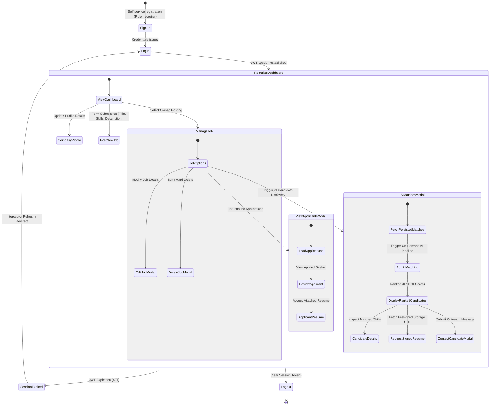

# Recruiter Lifecycle Flow

This state and lifecycle diagram documents the operational stages an authorized Recruiter traverses through the application.

```mermaid
stateDiagram-v2
    [*] --> Signup: Self-service registration (Role: recruiter)
    Signup --> Login: Credentials issued
    Login --> RecruiterDashboard: JWT session established

    state RecruiterDashboard {
        [*] --> ViewDashboard
        ViewDashboard --> CompanyProfile: Update Profile Details
        ViewDashboard --> PostNewJob: Form Submission (Title, Skills, Description)
        ViewDashboard --> ManageJob: Select Owned Posting
        
        state ManageJob {
            [*] --> JobOptions
            JobOptions --> EditJobModal: Modify Job Details
            JobOptions --> DeleteJobModal: Soft / Hard Delete
            JobOptions --> ViewApplicantsModal: List Inbound Applications
            JobOptions --> AIMatchesModal: Trigger AI Candidate Discovery
        }

        state AIMatchesModal {
            [*] --> FetchPersistedMatches
            FetchPersistedMatches --> RunAIMatching: Trigger On-Demand AI Pipeline
            RunAIMatching --> DisplayRankedCandidates: Ranked (0-100% Score)
            DisplayRankedCandidates --> CandidateDetails: Inspect Matched Skills
            DisplayRankedCandidates --> RequestSignedResume: Fetch Presigned Storage URL
            DisplayRankedCandidates --> ContactCandidateModal: Submit Outreach Message
        }

        state ViewApplicantsModal {
            [*] --> LoadApplications
            LoadApplications --> ReviewApplicant: View Applied Seeker
            ReviewApplicant --> ApplicantResume: Access Attached Resume
        }
    }

    RecruiterDashboard --> SessionExpired: JWT Expiration (401)
    SessionExpired --> Login: Interceptor Refresh / Redirect
    RecruiterDashboard --> Logout: Clear Session Tokens
    Logout --> [*]
```
