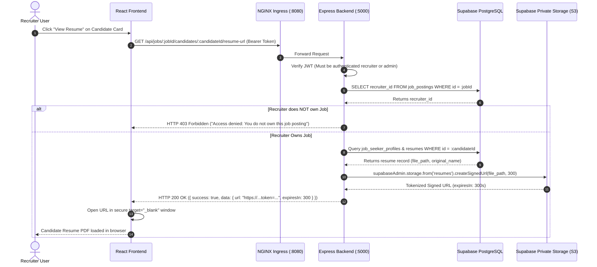

# Resume Access Sequence

This sequence diagram details the secure, tokenized signed URL generation flow that authorizes Recruiters to access candidate resumes from private storage.

```mermaid
sequenceDiagram
    autonumber
    actor Recruiter as Recruiter User
    participant React as React Frontend
    participant Ingress as NGINX Ingress (:8080)
    participant Express as Express Backend (:5000)
    participant Database as Supabase PostgreSQL
    participant Storage as Supabase Private Storage (S3)

    Recruiter->>React: Click "View Resume" on Candidate Card
    React->>Ingress: GET /api/jobs/:jobId/candidates/:candidateId/resume-url (Bearer Token)
    Ingress->>Express: Forward Request

    %% Step 1: Authentication & Role Check
    Express->>Express: Verify JWT (Must be authenticated recruiter or admin)

    %% Step 2: Job Ownership Check (BOLA / IDOR Defense)
    Express->>Database: SELECT recruiter_id FROM job_postings WHERE id = :jobId
    Database-->>Express: Returns recruiter_id
    alt Recruiter does NOT own Job
        Express-->>React: HTTP 403 Forbidden ("Access denied: You do not own this job posting")
    else Recruiter Owns Job
        %% Step 3: Candidate Resume Resolution
        Express->>Database: Query job_seeker_profiles & resumes WHERE id = :candidateId
        Database-->>Express: Returns resume record (file_path, original_name)
        
        %% Step 4: Short-Lived Signed URL Creation
        Express->>Storage: supabaseAdmin.storage.from('resumes').createSignedUrl(file_path, 300)
        Storage-->>Express: Tokenized Signed URL (expiresIn: 300s)

        %% Step 5: Secure Response
        Express-->>React: HTTP 200 OK ({ success: true, data: { url: "https://...token=...", expiresIn: 300 } })
        React->>React: Open URL in secure target="_blank" window
        React-->>Recruiter: Candidate Resume PDF loaded in browser
    end
```
