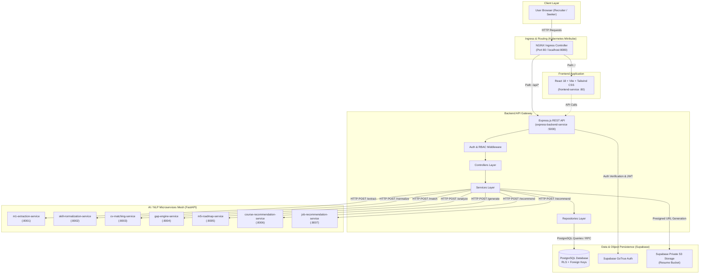

# System Architecture Diagram

This diagram documents the deployed system architecture of the AI Skill Mentor platform, illustrating the network topology, service mesh, Ingress routing, Express API gateway, and microservices ecosystem.

