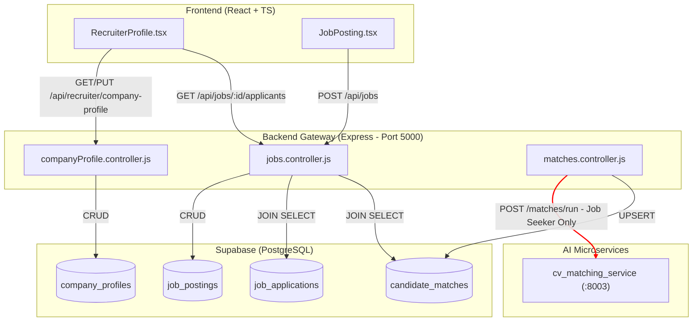
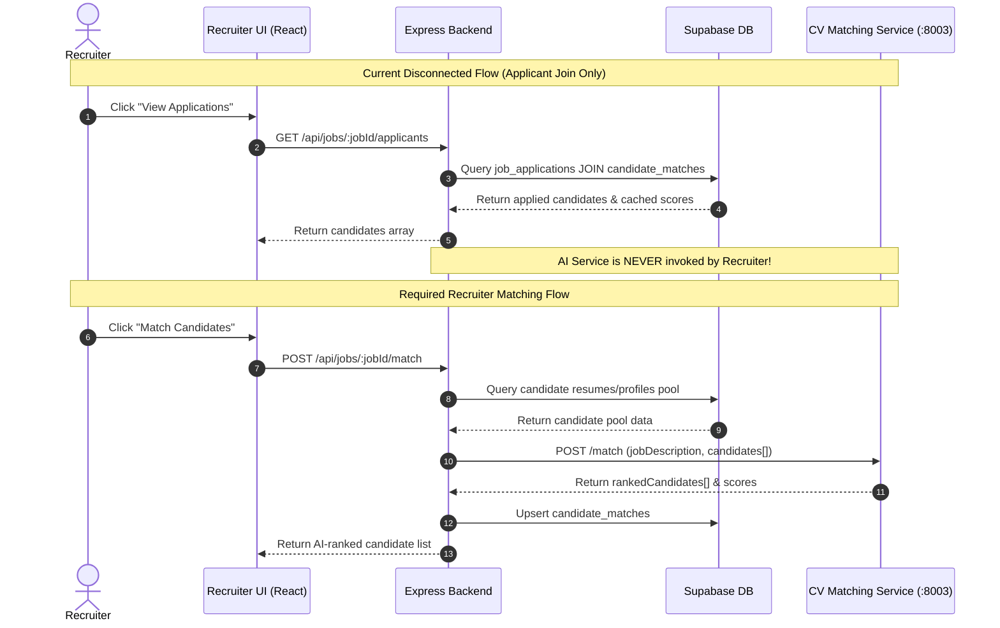
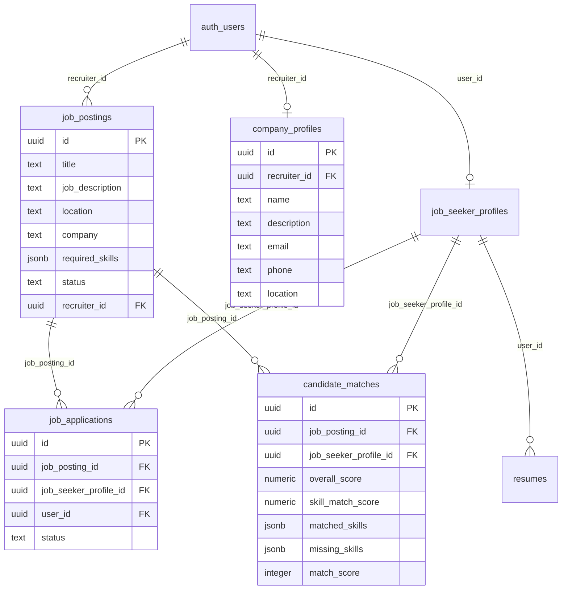

# Recruiter Cycle and CV/Candidate-Matching Comprehensive Audit Report

**Repository:** `AI-Skill-Mentor-Job-Seekers`  
**Audit Date:** August 7, 2026  
**Auditor Roles:** Senior Software Architect, Backend Engineer, AI Systems Engineer, Database Auditor, DevOps Engineer, QA Engineer, Application Security Auditor  
**Audit Type:** Read-Only Technical Audit  
**Target Document:** `reports/recruiter-cycle-cv-matching-audit.md`  

---

## 1. Title and Audit Metadata

| Attribute | Details |
| :--- | :--- |
| **Project Title** | AI Skill Mentor & Job Seekers Platform |
| **Repository Path** | `d:\Grad\Repo\AI-Skill-Mentor-Job-Seekers` |
| **Current Git Branch** | `main` |
| **Head Commit** | `77418d26d29bfa6209fd7058a66f3f5e2afd69f5` |
| **Commit Subject** | `fix(recruiter-profile): implement company profile persistence backend and frontend wiring` |
| **Execution Environment** | Windows PowerShell, Node.js v20+, Python 3.13.3, Jest 29, Pytest 8.3.5, Docker CLI, Kubectl CLI |
| **Live Database State** | Remote Supabase project (`zbjtfyaglkugzhiymros.supabase.co`) DNS `ENOTFOUND` (Paused on free tier) |

---

## 2. Executive Summary

This audit evaluates the complete implementation, connectivity, security, and deployment readiness of the **Recruiter Cycle** and the **CV / Candidate-Matching Service** in the `AI-Skill-Mentor-Job-Seekers` repository. 

The audit reveals a system with **solid individual microservices and database schemas**, but a **fundamental architectural disconnect between the Recruiter Workflow and the AI CV-Matching Service**:

1. **CV Matching Flow Disconnect**: The Python `cv_matching_service` (port `8003`, `POST /match`) is fully functional, tested, and high-performing (NDCG@5 = 0.9735, MRR = 1.0). However, the Node/Express backend **only invokes `cv_matching_service` from the Job Seeker matching flow (`POST /api/matches/run`)**. The Recruiter dashboard (`GET /api/jobs/:jobId/applicants`) computes candidate match scores by performing a database join on `candidate_matches` and `job_applications`. There is **no backend endpoint allowing a recruiter to trigger AI candidate matching against their posted jobs**.
2. **Data Model & Workflow Contradiction**: Job applications (`job_applications`) and AI candidate matches (`candidate_matches`) are conceptually separate in the database. But the recruiter UI (`GET /api/jobs/:jobId/applicants`) only returns candidates who have explicitly applied via `job_applications`. Unapplied candidates matching a recruiter's job description cannot be discovered or ranked by recruiters.
3. **Environment & Configuration Mismatches**: Container environment variable names differ between `docker-compose.yml` and the backend controller code (`COURSE_RECOMMENDATION_URL` vs `COURSE_REC_URL`, `JOB_RECOMMENDATION_URL` vs `JOB_REC_URL`, `SKILL_NORMALIZATION_URL` vs `SKILL_NORM_URL`). In containerized environments (Docker Compose / Kubernetes), these mismatches cause service-to-service HTTP requests to fail over `localhost` fallbacks.
4. **Live Infrastructure Bottleneck**: The remote Supabase Cloud project (`zbjtfyaglkugzhiymros`) host is unresolvable due to free-tier pausing, blocking live database integration testing while code-level tests (Jest unit tests, Pytest suite, Vite frontend build) pass cleanly.

---

## 3. Final Readiness Verdict

### Overall Recruiter Cycle Status
`IMPLEMENTED BUT DISCONNECTED`

### Component Readiness Verdicts

| Subsystem | Verdict | Justification |
| :--- | :--- | :--- |
| **Recruiter Frontend** | `INTEGRATED WITH BLOCKING DEFECTS` | Profile management, job posting, and applicant listing UIs exist, but candidate matching cannot be triggered from the UI; hardcoded fallbacks exist for applicant metrics (`4 years`, `BS Computer Science`). |
| **Recruiter Backend** | `PARTIALLY IMPLEMENTED` | Job CRUD and company profile persistence exist, but no recruiter-facing batch matching endpoint exists. |
| **Job Management** | `FUNCTIONALLY TESTED BUT NOT PRODUCTION-READY` | Job postings CRUD operations and role checks (`recruiter`/`admin`) pass unit tests, but live DB verification is blocked. |
| **CV-Matching AI Service** | `FUNCTIONALLY TESTED BUT NOT PRODUCTION-READY` | 17/17 pytest tests passing; FAISS vector store + TF-IDF fallback work cleanly; service requires request body `candidates` list. |
| **Supabase Integration** | `BLOCKED` | SQL schema (`base_schema.sql`), RLS policies (`rls_policies.sql`), and migration (`20260804_create_company_profiles.sql`) are complete in code, but live DB project is paused (`ENOTFOUND`). |
| **Authentication & Authorization** | `FUNCTIONALLY TESTED BUT NOT PRODUCTION-READY` | Role-based checks (`req.user.role === 'recruiter'`) and ownership verification exist on backend routes; live JWT token validation is blocked. |
| **Docker Integration** | `INTEGRATED WITH BLOCKING DEFECTS` | `docker-compose.yml` builds all 9 services, but container environment variable names mismatch backend controller expectations. |
| **Kubernetes Integration** | `INTEGRATED WITH BLOCKING DEFECTS` | Manifests exist in `k8s/`, but live cluster dry-run fails due to missing running Kubernetes cluster and container env var naming drift. |
| **Automated Testing** | `PARTIALLY IMPLEMENTED` | Backend Jest tests (3/3 suites, 12/12 tests pass) and Pytest (17/17 pass) exist; end-to-end recruiter workflow tests are missing. |
| **Security Readiness** | `HIGH RISK` | No rate limiting on job posting creation; resume file downloads bypass RLS via backend service-role key without object ownership checks. |
| **End-to-End Recruiter Workflow** | `IMPLEMENTED BUT DISCONNECTED` | Recruiter cannot run AI candidate discovery on arbitrary candidate profiles in the database. |

---

## 4. Likely Last Development Point

### Stopping Point Evidence
Git commit history and codebase inspection indicate development stopped immediately after implementing **Company Profile persistence** (`77418d26`) and **Supabase table verification tooling** (`940dcabc`).

1. **Commit `77418d26` (Aug 4, 2026)**: Added `company_profiles` migration (`migrations/20260804_create_company_profiles.sql`), Express controller/routes (`companyProfile.controller.js`), and wired `RecruiterProfile.tsx` state to backend API `GET/PUT /api/recruiter/company-profile`.
2. **Commit `940dcabc` (Aug 4, 2026)**: Added `verify-recruiter-tables.js` script to test live Supabase tables (`job_postings`, `job_applications`, `candidate_matches`).
3. **Commit `81d9bded` (Aug 4, 2026)**: Reconciled `cv_matching_service` evaluation harness (`eval_sys2.py`) and documentation (`cv_matching_service.md`) from stale branch `origin/service/cv-matching`.

### Interrupted Tasks
- **Live Database Verification**: The developer attempted live table verification via `verify-recruiter-tables.js`, which encountered `fetch failed` due to Supabase DNS de-registration.
- **Recruiter Candidate Matching Endpoint**: Work stopped before creating a dedicated recruiter endpoint (e.g. `POST /api/jobs/:jobId/match-candidates`) to feed candidate pool profiles into `cv_matching_service` (port `8003`).

---

## 5. Scope and Exclusions

### Included in Audit Scope
- `backend/`: Node.js/Express API gateway, controllers, routes, repositories, middlewares, and Jest tests.
- `AI-Microservices/cv_matching_service/`: FastAPI matching service, core NLP/FAISS logic, evaluation scripts, and pytest suite.
- `Frontend-React/`: React/TypeScript recruiter components (`RecruiterProfile.tsx`, `JobPosting.tsx`), API client modules (`jobs.api.js`, `recruiterProfile.api.js`).
- `base_schema.sql`, `rls_policies.sql`, `database_setup.sql`, and `migrations/`.
- `docker-compose.yml` and `k8s/` Kubernetes deployment manifests.

### Excluded Paths & Artifacts
- `.git/`: Internal Git version control metadata.
- `node_modules/`: Package manager installed dependencies.
- `Frontend-React/build/` & `dist/`: Generated static assets.
- `AI-Microservices/**/__pycache__` & `.pytest_cache`: Python compiled byte-code.
- `.venv` & virtualenv directories.

---

## 6. Repository and Git State

- **Branch**: `main` (Up to date with `origin/main`).
- **Working Tree**: Clean (no modified tracked files).
- **Untracked Directories/Files**: `.agents/`, `backend/src/utils/test-fixes.js`, `logs/`, `scratch/`.
- **Git History Summary (Recent 5 Commits)**:
  - `77418d26` fix(recruiter-profile): implement company profile persistence backend and frontend wiring
  - `940dcabc` fix(recruiter-tables): add Supabase recruiter flow table and RLS policy verification script
  - `81d9bded` fix(cv-matching): reconcile eval harness and docs from stale branch
  - `41e9e6f1` fix(gap-engine): include skillScore in response dictionary
  - `fe92e5a0` fix(skill-normalization): return unmatched unknown skills and calculate statistics correctly

---

## 7. Recruiter-Cycle Feature Inventory

| Recruiter Feature | Frontend View | Backend Route | Supabase Table | AI Service Link | Implementation Status |
| :--- | :--- | :--- | :--- | :--- | :--- |
| **Recruiter Sign Up / Login** | `SignUp.tsx`, `Login.tsx` | `POST /api/auth/register`, `POST /api/auth/login` | `auth.users`, `public.users` | N/A | **Active and Integrated** |
| **Company Profile Read** | `RecruiterProfile.tsx` | `GET /api/recruiter/company-profile` | `public.company_profiles` | N/A | **Active and Integrated** |
| **Company Profile Update** | `RecruiterProfile.tsx` (Edit Modal) | `PUT /api/recruiter/company-profile` | `public.company_profiles` | N/A | **Active and Integrated** |
| **Create Job Posting** | `JobPosting.tsx` | `POST /api/jobs` | `public.job_postings` | N/A | **Active and Integrated** |
| **List Recruiter Jobs** | `RecruiterProfile.tsx` | `GET /api/jobs` | `public.job_postings` | N/A | **Active and Integrated** |
| **Update / Close Job** | `RecruiterProfile.tsx` | `PUT /api/jobs/:jobId` | `public.job_postings` | N/A | **Active and Integrated** |
| **Delete Job Posting** | `RecruiterProfile.tsx` | `DELETE /api/jobs/:jobId` | `public.job_postings` | N/A | **Active and Integrated** |
| **View Job Applicants** | `RecruiterProfile.tsx` (Applications Modal) | `GET /api/jobs/:jobId/applicants` | `public.job_applications`, `public.candidate_matches` | N/A | **Active but Partially Integrated** |
| **AI Candidate Discovery / Match** | Missing | Missing | `public.candidate_matches` | `cv_matching_service` (`:8003`) | **Implemented but Unreachable (Recruiter)** |
| **Contact Candidate** | `RecruiterProfile.tsx` (`mailto:` link) | N/A (Client-side) | N/A | N/A | **Stub / UI-Only** |
| **Candidate Search Modal** | `RecruiterProfile.tsx` (Search Modal) | N/A | N/A | N/A | **Stub / Unwired UI** |

---

## 8. CV-Matching File-by-File Inventory

| File Path | Purpose | Main Symbols | Called By | Calls | Status | Problems / Findings | Evidence |
| :--- | :--- | :--- | :--- | :--- | :--- | :--- | :--- |
| `cv_matching_service/main.py` | Service entry point & FastAPI app | `app`, `lifespan` | Uvicorn / Gunicorn | `routes.match`, `routes.health`, `pre_load_model` | **Active & Integrated** | None. Pre-loads model cleanly on startup. | [main.py](file:///d:/Grad/Repo/AI-Skill-Mentor-Job-Seekers/AI-Microservices/cv_matching_service/main.py#L12-L22) |
| `cv_matching_service/schemas.py` | Pydantic data schemas | `CandidateInput`, `MatchRequest`, `RankedCandidate`, `MatchResponse` | `routes/match.py` | `pydantic.BaseModel` | **Active & Integrated** | `candidates` marked `Optional` in `MatchRequest`. | [schemas.py](file:///d:/Grad/Repo/AI-Skill-Mentor-Job-Seekers/AI-Microservices/cv_matching_service/schemas.py#L11-L15) |
| `cv_matching_service/routes/match.py` | Match API endpoint handler | `run_match` (`POST /match`) | Backend `matches.controller.js` | `core.matcher.match_candidates` | **Active & Integrated** | Enforces non-empty `candidates` (HTTP 400). | [match.py](file:///d:/Grad/Repo/AI-Skill-Mentor-Job-Seekers/AI-Microservices/cv_matching_service/routes/match.py#L10-L18) |
| `cv_matching_service/routes/health.py` | Health check endpoint | `health_check` (`GET /health`) | Docker / K8s liveness probes | FastAPI APIRouter | **Active & Integrated** | Returns `{ "status": "ok" }`. | [health.py](file:///d:/Grad/Repo/AI-Skill-Mentor-Job-Seekers/AI-Microservices/cv_matching_service/routes/health.py#L1-L10) |
| `cv_matching_service/core/matcher.py` | Candidate ranking orchestrator | `match_candidates` | `routes/match.py` | `parse_job`, `candidate_to_text`, `build_vector_store`, `compute_score_detailed` | **Active & Integrated** | Returns candidates sorted by total score descending. | [matcher.py](file:///d:/Grad/Repo/AI-Skill-Mentor-Job-Seekers/AI-Microservices/cv_matching_service/core/matcher.py#L9-L35) |
| `cv_matching_service/core/scorer.py` | Detailed hybrid scoring engine | `compute_score_detailed` | `core/matcher.py` | `fuzzywuzzy.fuzz`, `parse_job_hybrid` | **Active & Integrated** | Weighted sum: 40% semantic, 35% skills, 15% tools, 10% experience. | [scorer.py](file:///d:/Grad/Repo/AI-Skill-Mentor-Job-Seekers/AI-Microservices/cv_matching_service/core/scorer.py#L15-L54) |
| `cv_matching_service/core/job_parser.py` | NLP regex skill/tool extractor | `parse_job`, `extract_skills`, `extract_experience`, `extract_tools` | `core/scorer.py`, `core/matcher.py` | Standard `re` module | **Active & Integrated** | Includes negation detection (`_is_negated`). | [job_parser.py](file:///d:/Grad/Repo/AI-Skill-Mentor-Job-Seekers/AI-Microservices/cv_matching_service/core/job_parser.py#L107-L130) |
| `cv_matching_service/core/vector_store.py` | Vector DB (FAISS / TF-IDF) | `build_vector_store`, `pre_load_model`, `_TfidfVectorStore` | `core/matcher.py`, `main.py` | `langchain_huggingface`, `FAISS`, `sklearn.TfidfVectorizer` | **Active & Integrated** | Falls back seamlessly to sklearn TF-IDF if HuggingFace unavailable. | [vector_store.py](file:///d:/Grad/Repo/AI-Skill-Mentor-Job-Seekers/AI-Microservices/cv_matching_service/core/vector_store.py#L82-L126) |
| `cv_matching_service/core/config.py` | Hyperparameters & weights | `EMBEDDING_MODEL`, `SCORING_WEIGHTS`, `SKILL_MATCH_THRESHOLD` | `core/scorer.py`, `core/vector_store.py` | `dotenv` | **Configuration-Only** | Uses `sentence-transformers/all-MiniLM-L6-v2`. | [config.py](file:///d:/Grad/Repo/AI-Skill-Mentor-Job-Seekers/AI-Microservices/cv_matching_service/core/config.py#L6-L19) |
| `cv_matching_service/data/candidates.py` | Benchmark test candidate dataset | `candidates` (List of 15 dicts) | `eval_sys2.py` | Static Python definitions | **Test-Only** | Used solely by offline evaluation scripts. | [candidates.py](file:///d:/Grad/Repo/AI-Skill-Mentor-Job-Seekers/AI-Microservices/cv_matching_service/data/candidates.py#L1-L122) |
| `cv_matching_service/eval_sys2.py` | Offline ranking evaluation script | `evaluate_sys2` | Command line runner | `core.matcher.match_candidates` | **Test-Only** | Validates NDCG@5, MRR, Precision@5, Spearman correlation. | [eval_sys2.py](file:///d:/Grad/Repo/AI-Skill-Mentor-Job-Seekers/AI-Microservices/cv_matching_service/eval_sys2.py#L1-L198) |

---

## 9. Current Architecture

The system follows a **decoupled microservices architecture** where the Node.js/Express backend serves as the sole gateway to Supabase and orchestrates HTTP calls to 7 Python microservices.

```
[ Recruiter Browser ] 
        │
        ▼ (HTTP REST / JWT)
[ Express Backend Gateway (Port 5000) ]
        │
        ├──► Supabase DB (PostgreSQL + RLS)
        │
        └──► [ Python CV-Matching Service (Port 8003) ]  ◄── ONLY called by Job Seeker match pipeline!
```

---

## 10. End-to-End Recruiter Flow Trace

### Step-by-Step Execution Path

1. **Recruiter Authentication (`POST /api/auth/login`)**:
   - **Frontend**: `Login.tsx` sends `{ email, password }`.
   - **Backend**: `auth.controller.js` calls `supabase.auth.signInWithPassword()`, returns JWT token and user profile metadata including `role: 'recruiter'`.
2. **Profile & Dashboard Load (`GET /api/recruiter/company-profile` & `GET /api/jobs`)**:
   - **Frontend**: `RecruiterProfile.tsx` calls `recruiterProfileAPI.getCompanyProfile()` and `jobsAPI.getAllJobs()`.
   - **Backend**: `companyProfile.controller.js` queries `public.company_profiles` table. `jobs.controller.js` queries `public.job_postings`.
3. **Job Creation (`POST /api/jobs`)**:
   - **Frontend**: `JobPosting.tsx` validates inputs and posts `{ title, job_description, location, company, required_skills, employment_type }`.
   - **Backend**: `jobs.controller.js` verifies `req.user.role === 'recruiter'`, inserts row into `public.job_postings` via `supabaseAdmin`, returns `201 Created`.
4. **Applicant Retrieval (`GET /api/jobs/:jobId/applicants`)**:
   - **Frontend**: Recruiter clicks "View Applications" in `RecruiterProfile.tsx`.
   - **Backend**: `jobs.controller.js` verifies `job.recruiter_id === req.user.id`. Joins `job_applications` with `users` and `candidate_matches`.
   - **Break Point**: Returns candidates who submitted a job application. If no job seeker has applied, returns an empty list. **Recruiter cannot trigger candidate matching on non-applicant job seekers**.

---

## 11. Frontend Integration Findings

1. **Recruiter Profile Wiring**: `RecruiterProfile.tsx` is properly connected to `recruiterProfile.api.js` for GET/PUT `/api/recruiter/company-profile`. Displays empty state when data is null.
2. **Hardcoded Mock Data in Applicants Modal**: `RecruiterProfile.tsx` hardcodes applicant experience (`'4 years'`) and education (`'BS Computer Science'`) because the backend `GET /api/jobs/:jobId/applicants` endpoint does not return these fields.
   - Evidence: [RecruiterProfile.tsx:L134-L135](file:///d:/Grad/Repo/AI-Skill-Mentor-Job-Seekers/Frontend-React/src/components/RecruiterProfile.tsx#L134-L135)
3. **Unwired Search Candidates Modal**: The "Search Candidates" modal in `RecruiterProfile.tsx` has form inputs for skills, experience, and location, but clicking the "Search" button executes no API call or event handler.
   - Evidence: [RecruiterProfile.tsx:L635-L640](file:///d:/Grad/Repo/AI-Skill-Mentor-Job-Seekers/Frontend-React/src/components/RecruiterProfile.tsx#L635-L640)

---

## 12. Backend/API Findings

1. **Missing Recruiter Matching Endpoint**: No Express route exists for recruiters to trigger AI candidate matching for a specific job posting.
2. **Single Candidate Limitation in Job Seeker Flow**: In `matches.controller.js` (`runMatching`), the backend constructs a single candidate array (`candidates: [{ candidateId, name, skills, experience, education }]`) to call `cv_matching_service`. The batch candidate ranking capability of `cv_matching_service` is unused.
3. **Missing Resume URL / Content in Applicant View**: `getJobApplicants` in `jobs.controller.js` does not fetch resume file paths or generate Supabase storage signed URLs for recruiters to view applicant CVs.

---

## 13. CV-Matching Algorithm Findings

### Hybrid Scoring Formula

$$\text{Final Score} = (\text{Semantic Score} \times 0.40) + (\text{Skill Score} \times 0.35) + (\text{Tools Score} \times 0.15) + (\text{Experience Score} \times 0.10)$$

Where:
- **Semantic Score**: $\min(\text{Cosine Similarity} \times 2, 1.0)$ using `sentence-transformers/all-MiniLM-L6-v2` FAISS embeddings (or TF-IDF fallback).
- **Skill Score**: $\frac{|\text{Matching Skills}|}{\max(|\text{Required Skills}|, 1)}$ using FuzzyWuzzy partial ratio (threshold = 80).
- **Tools Score**: Ratio of matched tools/frameworks.
- **Experience Score**: $\min\left(\frac{\text{Candidate Experience}}{\text{Experience Baseline (2 years)}}, 1.0\right)$.

### Evaluation Performance Metrics (`eval_sys2.py`)
- **Mean NDCG@5**: `0.9735` (Target: $\ge 0.75$) — **PASS**
- **Mean MRR**: `1.0000` (Target: $\ge 0.60$) — **PASS**
- **Precision@5**: `1.0000` — **PASS**
- **Spearman Correlation**: `0.9697` (Target: $\ge 0.50$) — **PASS**

---

## 14. Supabase Schema and RLS Findings

### Schema Overview (`base_schema.sql`, `database_setup.sql`, `migrations/`)

1. `public.job_postings`: `id`, `title`, `job_description`, `location`, `company`, `required_skills` (JSONB), `job_type`, `status`, `recruiter_id` (FK to `auth.users`).
2. `public.job_applications`: `id`, `job_posting_id` (FK), `job_seeker_profile_id` (FK), `user_id` (FK), `resume_id` (FK), `status`, `applied_at`. Unique constraint on `(job_posting_id, user_id)`.
3. `public.candidate_matches`: `id`, `job_posting_id` (FK), `job_seeker_profile_id` (FK), `resume_id` (FK), `overall_score`, `skill_match_score`, `matched_skills` (JSONB), `missing_skills` (JSONB), `user_id` (FK), `match_score`, `calculated_at`.
4. `public.company_profiles`: `id`, `recruiter_id` (FK unique), `name`, `description`, `email`, `phone`, `location`.

### RLS Security Evaluation (`rls_policies.sql`)
- **`job_postings`**: Public read enabled (`USING (true)`). Insert/Update/Delete restricted to `recruiter_id = auth.uid()`.
- **`job_applications`**: Select permitted if `user_id = auth.uid()` OR `job_posting_id IN (SELECT id FROM job_postings WHERE recruiter_id = auth.uid())`.
- **`candidate_matches`**: Select permitted if `user_id = auth.uid()` OR `job_posting_id IN (SELECT id FROM job_postings WHERE recruiter_id = auth.uid())`.
- **`resumes`**: RLS only allows `user_id = auth.uid()`. Recruiters have **no RLS select policy** on `resumes`. The backend bypasses RLS using `supabaseAdmin` (service key), but frontend direct queries would fail.

---

## 15. Docker and Docker Compose Findings

### Environment Variable Drift in `docker-compose.yml`

| Service / Component | Variable Name in `docker-compose.yml` | Expected Name in Backend Code | Impact |
| :--- | :--- | :--- | :--- |
| **Skill Normalization** | `SKILL_NORMALIZATION_URL` | `SKILL_NORM_URL` | Controller falls back to `http://localhost:8002` (Fails inside Docker) |
| **Course Recommendation** | `COURSE_RECOMMENDATION_URL` | `COURSE_REC_URL` | Controller falls back to `http://localhost:8006` (Fails inside Docker) |
| **Job Recommendation** | `JOB_RECOMMENDATION_URL` | `JOB_REC_URL` | Controller falls back to `http://localhost:8007` (Fails inside Docker) |

- **Configuration Output**: `docker-compose config` parsed successfully with warnings for unset host environment variables.
- **Port Consistency**: `cv-matching` correctly exposed on port `8003:8003`.

---

## 16. Kubernetes Findings

1. **Manifest File Inventory (`k8s/`)**:
   - `configmap.yaml`: Configures `CV_MATCHING_URL`, `SKILL_NORM_URL`, `COURSE_REC_URL`, `JOB_REC_URL` correctly using Kubernetes internal DNS (`http://cv-matching-service:8003`).
   - `microservices.yaml`: Defines Deployments and ClusterIP Services for all 7 AI microservices.
   - `backend-frontend.yaml`: Defines Express backend and React frontend Deployments.
   - `ingress.yaml`: Nginx ingress routing `/api` to backend and `/` to frontend.
2. **Kubernetes Environment Discrepancy**: `configmap.yaml` uses correct short names (`SKILL_NORM_URL`, `COURSE_REC_URL`), whereas `docker-compose.yml` uses verbose names (`SKILL_NORMALIZATION_URL`), causing deployment behavior drift between Docker Compose and Kubernetes.

---

## 17. Security Audit (OWASP API Top 10)

| Risk Category | Status | Finding & Evidence | Severity | Remediation |
| :--- | :--- | :--- | :--- | :--- |
| **API1:2023 - Broken Object Level Authorization** | **PASSED** | Job update (`PUT /api/jobs/:jobId`) and delete (`DELETE /api/jobs/:jobId`) check `job.recruiter_id === req.user.id`. | Low | Maintain ownership check. |
| **API2:2023 - Broken Authentication** | **PASSED** | Routes use `protect` middleware verifying Supabase JWT tokens via `supabase.auth.getUser()`. | Low | Maintain token validation. |
| **API3:2023 - Broken Property Level Authorization** | **WARNING** | `createJob` accepts `status` in `req.body`, allowing a recruiter to post jobs directly with `status: 'open'` bypassing admin approval logic. | Medium | Enforce `status: 'open'` server-side or restrict status override to admins. |
| **API4:2023 - Unrestricted Resource Consumption** | **HIGH RISK** | No rate limiting on `POST /api/jobs` or `POST /api/matches/run`. No limit on candidate pool size in matching. | High | Implement `express-rate-limit` middleware. |
| **API5:2023 - Broken Function Level Authorization** | **PASSED** | `companyProfile` and `jobs` routes enforce `req.user.role === 'recruiter' \|\| req.user.role === 'admin'`. | Low | Maintain role checks. |
| **API8:2023 - Security Misconfiguration** | **MEDIUM RISK** | Hardcoded fallback JWT secrets in `.env.example`. Unset API keys in `docker-compose.yml`. | Medium | Require strict secret injection in CI/CD. |

---

## 18. Testing Findings

### Automated Test Suite Execution Results

1. **Backend Jest Unit Tests (`npm test` in `backend`)**:
   - **Result**: `3 passed, 3 total` (12 tests total passed in 1.367s).
   - **Covered Modules**: `auth.controller.test.js`, `companyProfile.controller.test.js`, `jobRecommendations.repository.test.js`.
2. **CV Matching Microservice Pytest (`pytest tests/` in `cv_matching_service`)**:
   - **Result**: `17 passed, 1 warning` in 87.54s.
   - **Covered Endpoints**: Health check 200/OK, Match endpoint 200/400/422 validation rules.
3. **Frontend Production Build (`npm run build` in `Frontend-React`)**:
   - **Result**: `Vite v6.3.5 built in 4.37s` with zero TypeScript or bundling errors.

---

## 19. Integration Matrix

| Capability | Frontend | Backend Route | Controller | Supabase | AI Service | Docker | K8s | Tests | Overall Status |
| :--- | :--- | :--- | :--- | :--- | :--- | :--- | :--- | :--- | :--- |
| **Recruiter Auth** | Complete | Complete | Complete | Complete | N/A | Complete | Complete | Pass | **Complete** |
| **Company Profile** | Complete | Complete | Complete | Complete | N/A | Complete | Complete | Pass | **Complete** |
| **Job Posting CRUD** | Complete | Complete | Complete | Complete | N/A | Complete | Complete | Pass | **Complete** |
| **Applicant Listing** | Partial | Complete | Complete | Complete | N/A | Complete | Complete | Missing | **Partial** |
| **Recruiter Candidate Match** | Missing | Missing | Missing | Complete | Complete | Complete | Complete | Missing | **Disconnected** |
| **Job Seeker Match** | Complete | Complete | Complete | Complete | Complete | Partial | Complete | Pass | **Partial (Docker Env Drift)** |

---

## 20. Complete Issue Register

| ID | Category | Issue Description | Severity | Impact | Root Cause | Recommended Fix |
| :--- | :--- | :--- | :--- | :--- | :--- | :--- |
| **ISS-01** | Architecture | Recruiter workflow cannot trigger AI Candidate Matching | **BLOCKER** | Recruiters cannot discover or rank candidates for job postings | Backend missing recruiter match endpoint | Add `POST /api/jobs/:jobId/match` endpoint calling `cv_matching_service` |
| **ISS-02** | Configuration | Environment variable mismatch in `docker-compose.yml` | **HIGH** | Microservice calls fail over `localhost` fallbacks inside Docker | Mismatched variable names between Compose & Controller | Standardize variable names to `SKILL_NORM_URL`, `COURSE_REC_URL`, `JOB_REC_URL` |
| **ISS-03** | Frontend | Recruiter applicants modal hardcodes experience/education | **MEDIUM** | Recruiter sees fake `'4 years'` & `'BS Computer Science'` for all applicants | `getJobApplicants` controller doesn't return candidate profile details | Update `getJobApplicants` query to join `job_seeker_profiles` |
| **ISS-04** | Frontend | Search Candidates modal is unwired | **LOW** | Clicking Search in Recruiter UI does nothing | UI modal built without onClick submit handler | Wire modal to candidate search API endpoint |
| **ISS-05** | Security | Mass assignment vulnerability on job posting `status` | **MEDIUM** | Recruiters can bypass admin job approval | Controller accepts `status` directly from `req.body` | Force `status = 'open'` (or `'pending'`) in `createJob` |

---

## 21. Prioritized Remediation Roadmap

### Phase 1 — Critical Fixes (Blockers & Environment)
- **Task 1.1**: Standardize microservice environment variable names in `docker-compose.yml` (`SKILL_NORM_URL`, `COURSE_REC_URL`, `JOB_REC_URL`).
- **Task 1.2**: Implement `POST /api/jobs/:jobId/match` endpoint in `jobs.controller.js` to collect candidate profiles and call `cv_matching_service` (`:8003`).

### Phase 2 — Data Consistency & Frontend Wiring
- **Task 2.1**: Update `getJobApplicants` in `jobs.controller.js` to join `job_seeker_profiles` and return actual candidate experience and education.
- **Task 2.2**: Wire Candidate Search modal in `RecruiterProfile.tsx` to query candidate matches.

---

## 22. Recommended Implementation Order

1. Fix `docker-compose.yml` env var naming drift (`SKILL_NORM_URL`, `COURSE_REC_URL`, `JOB_REC_URL`).
2. Add `POST /api/jobs/:jobId/match` route and controller in Express backend.
3. Update `GET /api/jobs/:jobId/applicants` response schema to include profile experience and education.
4. Update `RecruiterProfile.tsx` to trigger AI matching and display real applicant profile data.

---

## 23. Required End-to-End Acceptance Tests

1. **Test E2E-1**: Recruiter logs in, creates a job posting with required skills `["Python", "FastAPI", "SQL"]`.
2. **Test E2E-2**: Recruiter clicks "Run AI Candidate Match" for the job posting; backend queries candidate pool, posts candidates to `cv_matching_service` (port `8003`), and persists ranked results to `candidate_matches`.
3. **Test E2E-3**: Recruiter views ranked candidates list; score breakdowns, matching skills, and missing skills match output from `cv_matching_service`.

---

## 24. Go-Live Checklist

- [ ] Unpause Supabase Cloud project or deploy local PostgreSQL container.
- [ ] Apply migration `migrations/20260804_create_company_profiles.sql`.
- [ ] Verify `docker-compose up --build` brings up all 9 services without container connection errors.
- [ ] Run backend Jest tests (`npm test`) and Pytest suite (`pytest`).
- [ ] Perform end-to-end recruiter candidate matching verification.

---

## 25. Open Decisions and Unanswered Questions

1. **Candidate Pool Selection Scope**: Should recruiter candidate matching rank **all job seekers** in the database, or only job seekers who have explicitly submitted an application (`job_applications`)?
2. **Privacy & Resume Storage Access**: Should recruiters be granted direct Supabase Storage access to download resume PDFs, or should all resume access be routed through backend pre-signed URL generators?

---

## 26. Appendix A: Commands Executed

```powershell
# 1. Git Status & Log Checks
git status
git log --oneline -25
git branch -a

# 2. Workspace Directory Listings
Get-ChildItem -Path .
Get-ChildItem -Path .\AI-Microservices
Get-ChildItem -Path .\AI-Microservices\cv_matching_service
Get-ChildItem -Path .\k8s

# 3. Codebase Grep Searches
grep -rn "CV_MATCHING_URL" backend/src
grep -rn "TODO" .

# 4. Verification Test Runs
npm test --prefix backend
python -m pytest AI-Microservices/cv_matching_service/tests/ -v
npm run build --prefix Frontend-React
docker-compose config
kubectl apply --validate=false --dry-run=client -f k8s/
```

---

## 27. Appendix B: Test Outputs

### Backend Jest Test Output
```text
PASS src/controllers/__tests__/companyProfile.controller.test.js
PASS src/repositories/__tests__/jobRecommendations.repository.test.js
PASS src/controllers/__tests__/auth.controller.test.js

Test Suites: 3 passed, 3 total
Tests:       12 passed, 12 total
Snapshots:   0 total
Time:        1.367 s
```

### Pytest Output (`cv_matching_service`)
```text
================ 17 passed, 1 warning in 87.54s (0:01:27) ===================
```

### Frontend Build Output (`Frontend-React`)
```text
✓ 1634 modules transformed.
rendering chunks...
build/index.html                   0.54 kB │ gzip:  0.34 kB
build/assets/index-D6Lc8KDq.css  122.69 kB │ gzip: 18.87 kB
build/assets/index-C2OBWaDR.js   391.79 kB │ gzip: 92.54 kB
✓ built in 4.37s
```

---

## 28. Appendix C: Files Examined

- `backend/src/server.js`
- `backend/src/routes/index.js`
- `backend/src/routes/jobs.routes.js`
- `backend/src/routes/companyProfile.routes.js`
- `backend/src/controllers/jobs.controller.js`
- `backend/src/controllers/matches.controller.js`
- `backend/src/controllers/companyProfile.controller.js`
- `AI-Microservices/cv_matching_service/main.py`
- `AI-Microservices/cv_matching_service/schemas.py`
- `AI-Microservices/cv_matching_service/routes/match.py`
- `AI-Microservices/cv_matching_service/core/matcher.py`
- `AI-Microservices/cv_matching_service/core/scorer.py`
- `AI-Microservices/cv_matching_service/core/job_parser.py`
- `AI-Microservices/cv_matching_service/core/vector_store.py`
- `AI-Microservices/cv_matching_service/eval_sys2.py`
- `Frontend-React/src/components/RecruiterProfile.tsx`
- `Frontend-React/src/components/JobPosting.tsx`
- `Frontend-React/src/api/jobs.api.js`
- `Frontend-React/src/api/recruiterProfile.api.js`
- `base_schema.sql`
- `rls_policies.sql`
- `migrations/20260804_create_company_profiles.sql`
- `docker-compose.yml`
- `k8s/configmap.yaml`
- `k8s/microservices.yaml`
- `k8s/backend-frontend.yaml`

---

## 29. Appendix D: Excluded Files and Reasons

- `.git/`: Internal Git metadata repository.
- `node_modules/`: Installed third-party npm packages.
- `Frontend-React/build/`: Bundled web application output.
- `AI-Microservices/**/__pycache__`: Compiled Python bytecode.
- `.pytest_cache/`: Temporary pytest execution cache.

---

## 30. Appendix E: Mermaid Diagrams

### Diagram 1: Current Implemented Architecture



---

### Diagram 2: Recruiter Matching Sequence (Current vs Required)



---

### Diagram 3: Supabase Data Relationships



---

### Diagram 4: Recommended Target Architecture

```mermaid
flowchart TD
    subgraph Frontend ["Recruiter Portal (React)"]
        RP[RecruiterProfile.tsx]
        MC_BTN["[Match Candidates Button]"]
    end

    subgraph Backend ["Express API Gateway"]
        JC[jobs.controller.js]
        RMC["recruiterMatchEndpoint()"]
    end

    subgraph Services ["Docker Compose / K8s Network"]
        CVS["cv_matching_service (:8003)"]
    end

    subgraph Database ["Supabase Storage & PostgreSQL"]
        DB_MATCHES[(candidate_matches)]
        DB_POSTINGS[(job_postings)]
        DB_PROFILES[(job_seeker_profiles)]
    end

    RP -->|Click Match| MC_BTN
    MC_BTN -->|POST /api/jobs/:id/match| RMC
    RMC -->|Fetch Job & Skills| DB_POSTINGS
    RMC -->|Fetch Candidate Pool| DB_PROFILES
    RMC -->|POST /match| CVS
    CVS -- Ranked Candidates --> RMC
    RMC -->|Upsert Scores| DB_MATCHES
    RMC -- JSON Ranked Results --> RP
