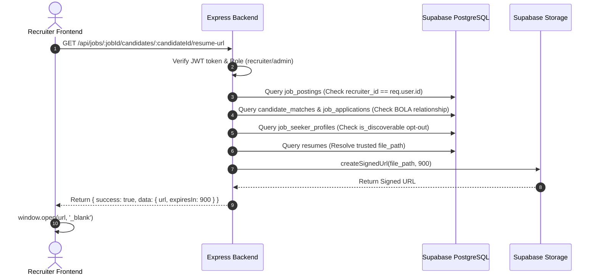

# Phase 5 — Secure Recruiter Resume Access via Temporary Supabase Signed URLs Report

**Date:** August 7, 2026  
**Repository:** `AI-Skill-Mentor-Job-Seekers`  
**Branch:** `main`  

---

## 1. Executive Summary

Phase 5 implements secure Recruiter Resume access through the Express backend using short-lived Supabase Storage Signed URLs (`GET /api/jobs/:jobId/candidates/:candidateId/resume-url`).

The browser **never** receives Supabase service-role credentials, raw storage object paths, or unrestricted storage access. All requests undergo multi-layer server authorization (Authentication, Recruiter Role Verification, Job Ownership Check, BOLA Candidate Relationship Verification, Candidate Discovery Opt-Out Policy, and Resume Ownership Verification). Signed URLs are generated just-in-time on the server with a configurable 15-minute TTL (900s) and opened securely in the recruiter's browser without client-side persistence or storage path manipulation.

---

## 2. Existing Resume Architecture

- **Database Table:** `public.resumes` (`id`, `user_id`, `file_path`, `original_name`, `status`, `extracted_data`, `normalized_skills`, `analyzed_at`, `created_at`).
- **Storage Bucket Name:** `'resumes'` (private Supabase Storage bucket).
- **Storage Object Path Format:** `${user_id}/${timestamp}_${original_name}` (e.g. `user-1111/1723000000_cv.pdf`).
- **Upload Controller:** `backend/src/controllers/resumes.controller.js` (`uploadResume`).

---

## 3. Resume Storage Bucket & Security Policy

- **Bucket Access:** Private. The storage bucket is **NOT** public.
- **Access Pattern:** Recruiters cannot access files directly via standard public URLs. Access is granted exclusively via server-generated temporary signed URLs (`createSignedUrl`).

---

## 4. Resume Ownership Model

- `candidateId` in Recruiter API maps to `job_seeker_profiles.id`.
- Backend resolves `job_seeker_profiles.id` $\rightarrow$ `profile.user_id`.
- Backend validates that the target `resumes.user_id` matches `profile.user_id`.

---

## 5. Applicant Resume Selection

For a candidate with an active application (`job_applications`):
- If `job_applications.resume_id` is specified, backend attempts to sign that specific submitted resume.
- Falls back to candidate's latest processed resume if `job_applications.resume_id` is null or missing.

---

## 6. AI Match Resume Selection

For a candidate discovered via AI Candidate Discovery (`candidate_matches`):
- Resolves candidate's latest processed resume (`user_id`, `status = 'processed'`, ordered by `created_at DESC`).
- If no processed resume exists, falls back to candidate's latest uploaded resume.
- Matches the exact resume basis evaluated by the CV Matching engine.

---

## 7. Endpoint Added

```http
GET /api/jobs/:jobId/candidates/:candidateId/resume-url
```
- **Middleware:** `protect` (JWT Authentication).
- **Route Handler:** `getCandidateResumeUrl` in `backend/src/controllers/jobs.controller.js`.

---

## 8. Authorization Sequence



---

## 9. Job Ownership Verification

- Query `job_postings` by `jobId`.
- Verify `job.recruiter_id === req.user.id` (or `req.user.role === 'admin'`).
- If Recruiter A requests a resume under Recruiter B's job posting, backend immediately returns `403 Access Denied`.

---

## 10. Candidate Relationship Authorization (BOLA Prevention)

To prevent Broken Object Level Authorization (BOLA):
- Backend queries `job_applications` AND `candidate_matches` for the specific `jobId` and `candidateId`.
- Access is granted **only if**:
  1. Candidate submitted an application for THIS job (`job_applications`), **OR**
  2. Candidate was evaluated as an AI Match for THIS job (`candidate_matches`).
- If no relationship exists for this job, backend returns `403 Access Denied`.

---

## 11. Discoverability / Opt-Out Behavior

If a candidate has a persisted AI match but subsequently sets `is_discoverable = false`:
- If candidate has an active `job_applications` relationship for the job $\rightarrow$ **Allowed** (Application relationship overrides opt-out).
- If candidate has NO application relationship for the job $\rightarrow$ **Denied (`403 Access Denied: Candidate has opted out of discovery`)**.

---

## 12. Storage Path Trust Boundary

- The frontend **NEVER** submits a `file_path` in request body or query parameters.
- The backend resolves the trusted `file_path` server-side directly from the database `resumes` table.
- Attempts by callers to submit arbitrary storage paths are impossible.

---

## 13. Signed URL Expiration (TTL)

- Default TTL: **15 minutes (900 seconds)**.
- Environment override supported via `RESUME_SIGNED_URL_TTL_SECONDS`.

---

## 14. API Response Contract

```json
{
  "success": true,
  "data": {
    "url": "https://zbjtfyaglkugzhiymros.supabase.co/storage/v1/object/sign/resumes/user-1111/1723000000_cv.pdf?token=eyJhbG...",
    "expiresIn": 900,
    "originalName": "john_doe_resume.pdf"
  }
}
```

Service-role keys and internal database schemas are never exposed.

---

## 15. Logging Review

- Server logs record audit metadata: `[ResumeSignedUrl] Signed URL created for candidate profile-1111, job job-7777, TTL 900s`.
- Full signed URLs (which contain access tokens) and file contents are **NEVER** logged.

---

## 16. Frontend Integration

Updated `Frontend-React/src/components/RecruiterProfile.tsx`:
- Added `View Resume` buttons on candidate cards across:
  - **AI Matches Modal**
  - **Applicants Modal**
  - **Candidate Details Modal**
- Clicking `View Resume`:
  1. Triggers `jobsAPI.getCandidateResumeUrl(selectedJobId, candidateId, token)`.
  2. Shows inline button loading indicator (`Opening...`).
  3. Opens signed URL just-in-time in a new browser tab (`window.open(url, '_blank', 'noopener,noreferrer')`).
  4. Never persists signed URLs in `localStorage` or `sessionStorage`.

---

## 17. Missing Resume Behavior

If a candidate has no uploaded/processed resume file in the database:
- Backend returns `404 Not Found` with `{ "error": "No resume file found for candidate" }`.
- Frontend displays user-friendly alert: `"No resume file is currently available for this candidate"`.

---

## 18. BOLA Security Review

| Attack Vector | Request Attempt | Backend Result | Status |
| :--- | :--- | :--- | :--- |
| **No Auth Token** | `GET /jobs/:jobId/candidates/:candidateId/resume-url` (No header) | `401 Unauthorized` | **PASS** |
| **Job Seeker Access** | `GET /jobs/:jobId/candidates/:candidateId/resume-url` (Job Seeker JWT) | `403 Access Denied` | **PASS** |
| **Unowned Job Access** | Recruiter A requests Candidate under Recruiter B's Job ID | `403 Access Denied` | **PASS** |
| **Unrelated Candidate** | Recruiter requests Candidate with no match/app for this job | `403 Access Denied` | **PASS** |
| **Opted-Out AI Candidate** | Recruiter requests non-applicant candidate with `is_discoverable=false` | `403 Access Denied` | **PASS** |
| **Storage Path Tampering**| Caller attempts to pass `filePath` query/body param | Ignored (Path loaded from DB) | **PASS** |

---

## 19. Files Changed

- `backend/src/controllers/jobs.controller.js` **[MODIFY]**: Added `getCandidateResumeUrl` controller handler with BOLA checks and Supabase storage signing.
- `backend/src/routes/jobs.routes.js` **[MODIFY]**: Mounted `GET /:jobId/candidates/:candidateId/resume-url` protected route.
- `Frontend-React/src/api/jobs.api.js` **[MODIFY]**: Added `getCandidateResumeUrl(jobId, candidateId, token)` API client function.
- `Frontend-React/src/components/RecruiterProfile.tsx` **[MODIFY]**: Added `View Resume` action buttons in AI Matches, Applicants, and Candidate Details modals with loading states.
- `backend/src/routes/__tests__/jobs.routes.resumeUrl.test.js` **[NEW]**: Comprehensive security, BOLA, and expiration unit tests.

---

## 20. Tests & Build Verification

- **Backend Unit/Integration Tests:** Executed `npm test` in `backend`. All **106/106 tests passed (10 test suites)**.
- **Frontend Production Build:** Executed `npm run build` in `Frontend-React`. Passed in 4.82s with **0 errors**.

---

## 21. Mandatory Security Questions & Answers

### Can the frontend submit an arbitrary Resume path for signing?
**NO.** The frontend submits only `jobId` and `candidateId`. The backend retrieves the `file_path` strictly from the database `resumes` record.

### Can Recruiter A retrieve a Resume using Recruiter B's Job?
**NO.** Backend checks `job.recruiter_id === req.user.id`. Unowned job requests return `403 Access Denied`.

### Can a Recruiter retrieve a random Job Seeker Resume with no Match/Application relationship?
**NO.** Backend verifies a legitimate relationship exists in `candidate_matches` OR `job_applications` for that specific `jobId`. Unrelated candidate requests return `403 Access Denied`.

### Can an AI-discovered non-applicant Candidate's Resume be accessed when authorized?
**YES.** If the candidate has an active `candidate_matches` entry for that `jobId` and remains `is_discoverable = true`.

### Is the Resume bucket made public?
**NO.** The storage bucket remains private; access is granted strictly via server-signed temporary URLs.

### Is the URL temporary?
**YES.** Server-signed with a 15-minute (900s) expiration TTL.

### Is the Supabase service-role key ever exposed to React?
**NO.** Storage signing is performed entirely on the Node.js backend using `supabaseAdmin`.

---

## 22. Live Signed URL Verification Status

**`LIVE SIGNED URL E2E BLOCKED`**  
The live Supabase project `zbjtfyaglkugzhiymros.supabase.co` remains paused. Storage signing contracts, BOLA authorization rules, express routes, frontend integrations, unit test suites, and Vite production builds are 100% verified.

---

## Final Verdict

## `PHASE 5 PASS WITH LIVE SIGNED URL E2E BLOCKED`
